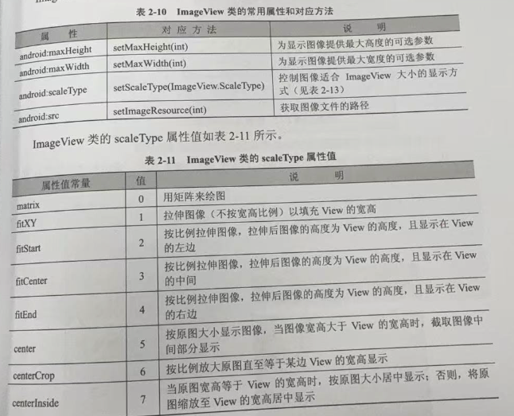
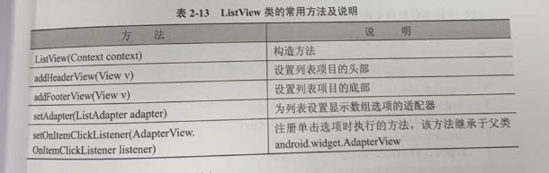
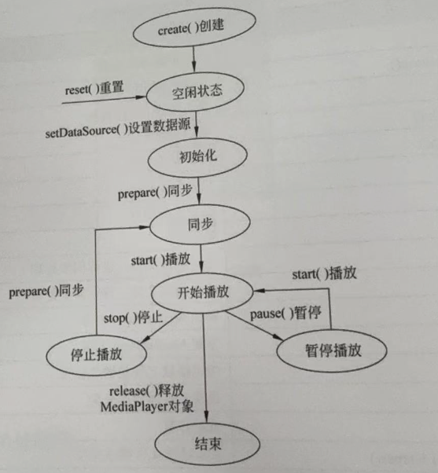
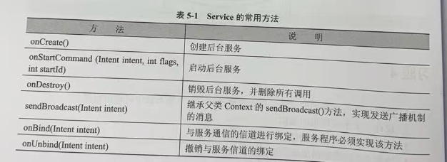
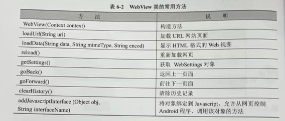

---
markmap:
    maxWidth: 500
---

# Android 开发笔记

## 安卓系统及其开发过程<!-- markmap: fold -->

### Android 的系统架构

- 应用程序层
    - 电话拨号程序
    - 短信程序
    - 日历
    - 音乐播放器
    - 浏览器
    - 联系人管理程序
- 应用程序框架层
    - 活动页管理
    - 窗口管理
    - 内容供应
    - 视图系统
    - 包管理
    - 电话管理
    - 资源管理
    - 位置管理
    - 通知管理
- 系统运行库层
    - 程序库
    - Android 运行时库
        - 该核心库提供了 Java 编程语言核心库的大多数功能，Android 系统的 Dalvik 虚拟机也包含在该运行时库中
- Linux 核心层

### Android 开发分类

- 系统移植开发
- Android 应用程序开发

### Android 应用程序开发过程

- 在 Android Studio 集成环境中生成应用项目框架
- 修改或编写 XML 源程序
- 修改或编写 Java 源程序
- 调用模拟器运行应用程序

### Android 项目结构

- mainfests
    - mainfest：XML 文件的根节点，包含了 package 中的所有内容
    - xmlns:android：命名空间声明
    - package：应用的包名
    - uses-sdk：应用的目标 SDK 版本
    - application：声明一些全局属性，如标签、图标、必要的权限等
    - android:icon：应用的图标
    - android:label：应用的名称
    - activity：与用户交互的图形界面
    - android:name：默认启动的 Activity
    - intent-filter：声明一组组件支持的 intent 值
    - action：声明目标组件执行的 intent 动作
    - category：指定目标组件支持的 intent 类别
- java：源代码、测试代码
- res：资源目录，存储所有的资源
    - drawable：存放图片资源
    - layout：存放界面 XML 布局文件
    - mipmap：存放系统的图片资源
    - values：存放字符串、颜色、尺寸、数组、主题、类型等资源
    - raw：任意类型的文件，一般是音频、视频、图片、文档
    - assets：任意类型，与 raw 相比，**不会在 R 类中生成 id**
- values：存储 app 引用的信息
    - colors.xml：颜色定义
    - strings.xml：字符串定义
    - dimens.xml：存储了一些公用的 dip 值
    - styles.xml：样式定义
- Gradle Scripts：build.gradle 为项目的 gradle 配置文件

## Android 用户界面设计<!-- markmap: fold -->

### 用户界面设计和 View 类

- 应用界面由 **View** 类和 **ViewGroup** 对象构建
- ViewGroup 对象都是 View 类的子类
- View 类是所有可视化组件的共同父类
- View 类的常用属性和方法：
    - android:background、setBackgroundColor：设置背景颜色
    - android:id、setId：设置 View 的 id
    - android:alpha、setAlpha：设置 View 的透明度，取值范围为 0～1
    - android:view、findViewById：通过 id 获取 View 对象
    - android:visibility、setVisibility：设置组件的可见性
    - android:clickable、setClickable：设置组件是否可以点击

### Android 布局管理

- ContraintLayout
- LinearLayout
- FrameLayout。将组件放到左上角的位置，当添加多个组件时，**后面的组件将遮盖之前的组件**
- TableLayout
    - `android:shrinkColumns` 属性设置表格的 *列数*
    - `<TableRow>` 标签设置表格的 *行数*
    - `android:layout_column` 设置组件属于 *哪一列*
- GridLayout。Android 4.0 引入的布局
    - `alignmentMode` ：指定组件的 *对齐方式*
    - `columnCount` ：指定 *列数*
    - `rowCount` ：指定 *行数*
    - `layout_columnSpan` ：设置组件 *占据列数*
    - `layout_rowSpan` ：设置组件 *占据行数*

### 布局文件的重要属性

- 设置组件大小的单位
    - px：屏幕上的发光点
    - dp：设备独立像素，支持多分辨率的抽象单位
    - sp：比例像素

### Button

- java 的类都是 Object 类的子类，View 类也继承自 Object 类，TextView 类继承自 View 类，Button 类继承自 TextView 类

### 文本编辑框也继承自 View 类

- 

### 列表组件类

- 
- android.R.layout.simple_list_item_1：单一文本项
- android.R.layout.simple_list_item_2：一行 title，一行 text
- android.R.layout.simple_list_item_single_choice：单选列表项
- android.R.layout.simple_list_item_multiple_choice：多选列表项

## 多个用户界面的程序设计<!-- markmap: fold -->

### 显/隐式意图

- 根据“目标组件是否明确指定”，可分为两大类：显示式意图（Explicit Intent）和隐式意图（Implicit Intent）
    - 显式意图：开发者在 Intent 中直接 指明目标组件的完整名称（包名 + 类名），或通过 setClass() / setComponent() / setClassName() 等方法将目标 Activity / Service 明确指定。
    - 隐式意图：不指明具体组件，而是 描述要执行的“动作 + 数据 + 类别 + 额外信息”

### 页面切换与传递参数值

- Intent 的属性
    - 动作（Action）
    - 数据（Data）
    - 类别（Category）
    - 类型（Type）
    - 组件（Component）
    - 扩展数据（Extra）

### 在 Activity 之间传递数据

- Bundle 的方法
    - `putString`
    - `remove`
    - `getString`
- Intent 操作 Bundle 组件的方法
    - `getExtras`
    - `putExtras`

### 菜单设计

- 选项菜单
- 上下文菜单
- 子菜单

## 图形与多媒体处理<!-- markmap: fold -->

### 绘制几何图形

- Canvas
- Paint
- Path

### 简单的触摸屏事件

- MotionEvent.ACTION_DOWN：在屏幕上点击
- MOtionEvent.ACTION_UP：松开手指
- MotionEvent.ACTION_MOVE：移动手指

### 多媒体处理播放器

- MediaPlayer 
    - 常用方法
        - create() ：创建多媒体播放器
        - prepare() ：准备多媒体资源，进行同步处理
        - prepareAsync() ：准备多媒体资源，进行异步处理
        - release() ：释放资源
        - reset() ：重置播放器
        - seekTo() ：调整播放位置
        - setDataSource() ：设置多媒体资源路径
        - setOnCompletionListener() ：设置播放完成监听器
        - stop() ：停止播放
        - start() ：开始播放
        - pause() ：暂停播放
    - 生命周期
        - 

## 后台服务与系统服务<!-- markmap: fold -->

### 后台服务

- 后台服务（Service）是一种类似于 Activity 的组件，但 Service 没有用户操作界面，也不能自己启动，主要作用是提供后台服务调用，即使用户关闭应用界面，Service 也不会停止。
- Service 的生命周期
    - onCreate()：创建 Service
    - onStartCommand()：启动 Service
    - onDestroy()：销毁 Service
- 常用方法
    - 
- 一个服务只能创建一次、销毁一次，但可以开始多次
- 设置一个后合服务的应用程序大致有以下几个步骤
    - 创建 Service 的子类
        - 编写 onCreate 方法，创建后台服务:
        - 编写 onStartCommand 方法，启动后台服务:
        - 编写 onDestoy 方法，终止后台服务，并删除所有调用。
    - 创建启动和控制 Service 的 Activity：
        - 创建 Intent 对象，建立 Activity 与 Service 的关联:
        - 调用 Activity 的 startService(Intent)方法启动 Service 后台服务:
        - 调用 Activity 的 stopService(Intent)方法关闭 Service 后台服务、
    - 修改配置文件 AndroidManifest.xml。在配置文件 AndroidManifest.xml 的<application>标签中添加以下代码:`<service android:enabled=""true" android:name=".Audiosry" />`
- `onStartCommand()` 方法的返回值
    - 如果希望 Service 一直存活并且保留上次启动它的 intent 的数据，那么 return START_REDELIVER_INTENT；
    - 如果只希望 Service 一直存活不需要 intent 中的数据，那么return START_STICKY；
    - 如果希望 Service 执行完指定的任务后销毁，那么 return START_NOT_STICKY；
    - 如果没有什么要求那么直接 return super.onStartCommand ；

## 网络通信<!-- markmap: fold -->

### Web 视图

- WebView 的常用方法
    - 
- 记得要设置：`android:usesCleartextTraffic="true"`

## 复习<!-- markmap: fold -->

### Android 复习 Workflow

1. 做实验 x2hours
1. 做题 x40mins
    1. 涂答案 3 页
    1. 做 3 页
    1. 对答案
    1. 整理错题
    1. 返回 1
1. 看导图 x20mins
1. 返回 1

### 错题

- 语言
    - 想让软件支持简体中文、美式英语两种环境，需要在 res 目录下新建两个 values 文件夹，分别命名为 *values-zh-rCH* 和 *values-en-rUS*，并在其中分别创建 strings.xml 文件，然后分别在文件中定义字符串资源
- 配置
    - Minimum Required SDK 代表 *程序最低兼容的版本*
    - SDKManager 是 Android SDK 的管理工具，双击它可以看到所有可下载的额 Android SDK 版本
    - 用于给 Activity 指定主题的属性是 `theme`
    - 用于给控件指定主题的属性是 `style`
    - 设置 Activity 的 `android:theme` 属性可以指定主题样式
    - 样式文件是在 `styles` 目录下创建的
    - 通常使用 *主题* 定义一个界面/整个软件的风格，使用 *样式* 定义控件的风格
    - 在 Activity 代码中也可以引用自定义主题，只需要在 `onCreate` 方法内添加 `setTheme` 即可
    - ❌样式的标签是用来声明属性值的。
        - 解析：在 Android 的 `styles.xml` 中，属性值真正是通过 `<item name="属性名">值</item>` 来声明的；`<style>` 标签本身只是用来定义一个样式并对这些 `<item>` 进行分组，而不是直接用来声明单独的属性值。因此说“样式的标签是用来声明属性值的”并不准确。
    - Android 有自己的国际化规范和方法，布局文件中的所有文字资源只有通过 `R.string.<string_name>` 引用才能起到效果
    - 设置 Activity 的启动模式：android:launchMode
    
- 布局
    - 在相对布局文件中，把控件显示在另外一个控件的右侧使用的属性是 `layout_toRightOf`
    - 放入绝对布局的控件需要通过 `android:layout_x` 和 `android:layout_y` 属性来设置它的位置
- 其他
    - gen 目录是自动生成的， *不允许* 用户修改
    - Android 使用 *任务栈* 的方式来管理 Activity 的实例
    - Intent 传递类对象时，该对象需要实现 Serializable 或 Parcelable 接口
    - Map 类型不能使用 Intent 传递
    - 启动系统相机使用的 action 是 IMAGE_CAPTUR
    - Activity 的生命周期
        - 运行状态。处于屏幕最前段，可见、有焦点，可以与用户交互
        - 暂停状态。
        - 停止状态。
    - Activity 获取焦点执行的方法是 `onResume()`
    - 当 Activity 处于运行状态时，Android 会尽可能地保持它的运行，即使出现内存不足的情况，Android 也会先杀死栈底部的 Activity，来确保可见的 Activity 正常运行
    - Activity 默认的启动模式是 standard，在不指定启动模式的情况下，Acticity 使用的都是 standard 模式
    - 当 Acticity 处于销毁状态时，将被清理出内存
    - 关闭 Activity 的界面时，将会执行 onPause、onStop、onDestroy 方法
    - 从 Activity 启动到完全出现在用户面前会执行 onCreate、onStart、onResume 三个方法
    - intent 的作用是激活组件和传递参数

    