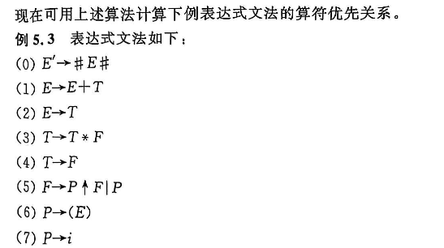

# 编译原理笔记

## 引论

- 什么是编译程序：把一种语言（源语言）书写的程序翻译成另一种语言（目标语言）的等价程序。

!!! tip "编译过程"

    

## 文法和语言

### Preliminaries

- **文法**：四元组 $(V_N, V_T, P, S)$，其中 $V_N$ 为非终结符集合，$V_T$ 为终结符集合，$P$ 为产生式集合，$S$ 为开始符号。$V_N \cap V_T = \phi$，$V_N \cup V_T = V$，$V$ 为所有符号集合。

!!! tip "我理解的文法"

    语言的指导规则。

- **规则**（重写规则、产生式、生成式）：是形如 $\alpha \rightarrow \beta$ 或 $\alpha ::= \beta$ 的 $(\alpha, \beta)$ 有序对，其中 $\alpha$ 为产生式左部，$\beta$ 为产生式右部。$\alpha \rightarrow \beta$ 或 $\alpha ::= \beta$ 读作 *定义为* 。
- **直接推导**：设 $\alpha \to \beta$ 是文法 $G=(V_N, V_T, P, S)$ 的规则，$\gamma$ 和 $\delta$ 是 $V^*$ 中的任意符号，若有符号串 $v, w$ 满足$v = \gamma \alpha \delta,~w = \gamma \beta \delta$，即说 $v$ 直接产生 $w$，或说 $v$ 是 $w$ 的直接推导，或说 $w$ 直接归约到 $v$，记作 $v \Rightarrow w$。
- **多步推导 $(\geq 1)$**：$v \xRightarrow{+} w$
- **多步推导 $(\geq 0)$**：$v \xRightarrow{*} w$
- **句型**：设 $G[S]$ 是一个文法，如果符号串 $x$ 是从识别符号推导出来的，即有 $S \Rightarrow x$，则称 $x$ 是文法 $G[S]$ 的句型。
- **句子**：若 $x$ 仅由终结符号组成，即 $S \Rightarrow x, x \in V_T^*$，则称 $x$ 为 $G[S]$ 的句子。
- **语言**：文法 $G$ 所产生的语言定义为集合 $\{x \mid S \xRightarrow{*} x, \text{其中 } S \text{ 为文法识别符号, 且 } x \in V_T^*\}$。可用 $L(G)$ 表示该集合。
- **等价文法**：若 $L(G1)=L(G2)$，则称这两个文法是等价的。

### 文法的类型

- **0 型文法**：设 $G = (V_N, V_T, P, S)$，如果它的每个产生式 $\alpha \rightarrow \beta$ 是这样一种结构：$\alpha \in (V_N \cup V_T)^*$ 且至少含有一个非终结符，而 $\beta \in (V_N \cup V_T)^*$，则 $G$ 是一个 0 型文法。

!!! tip "0 型文法｜直观理解"

    对于产生式限制最少的文法，基本意思就你是个产生式就行。所以，$x(x\geq1)$ 型文法，也都是 0 型文法。

- **1 型文法**：设 $G = (V_N, V_T, P, S)$ 为一个文法，若 $P$ 中的每一个产生式 $\alpha \rightarrow \beta$ 均满足 $|\beta| \geq |\alpha|$，仅仅 $S \rightarrow \varepsilon$ 除外，则文法 $G$ 是 1 型或**上下文有关的**（context-sensitive）。

!!! tip "1 型文法｜直观理解"

    每一步推导都会导致串非严格递增。

- **2 型文法**：设 $G = (V_N, V_T, P, S)$，若 $P$ 中的每一个产生式 $\alpha \rightarrow \beta$ 满足：$\alpha$ 是一个非终结符，$\beta \in (V_N \cup V_T)^*$，则此文法称为 2 型的或**上下文无关的**（context-free）。

!!! tip "2 型文法｜直观理解"

    在 0 型文法上增加了限制条件，左边必须是非终结符。

- **3 型文法**：设 $G = (V_N, V_T, P, S)$，若 $P$ 中的每一个产生式的形式都是 $A \rightarrow aB$ 或 $A \rightarrow a$，其中 $A$ 和 $B$ 都是非终结符，$a \in V_T^*$，则 $G$ 是 3 型文法或正规文法。

!!! tip "3 型文法｜直观理解"

    在 2 型文法上增加了限制条件，右边必须是终结符或终结符加非终结符的形式。

    由于这样的形式，正规文法是**没有左递归**的。

### 上下文无关文法（2 型）文法及其语法树

- **最左推导**：如果在推导的任何一步 $\alpha \Rightarrow \beta$（$\alpha$、$\beta$ 是句型），都是对 $\alpha$ 中的最左非终结符进行替换，则称这种推导为最左推导。
- **最右推导**（规范推导）：如果在推导的任何一步 $\alpha \Rightarrow \beta$（$\alpha$、$\beta$ 是句型），都是对 $\alpha$ 中的最右非终结符进行替换，则称这种推导为最右推导。
- **右句型**（规范句型）：由规范推导所得的句型。

### 句型的分析

## 词法分析

## 自顶向下的语法分析方法

## 自低向上优先分析

## LR 分析

### LR 分析概述

实际上，LR 分析器就是一个**状态转换图**，分析表就是一个**状态转换表**。这与 DFA 是一致的。

- LR 分析器有 3 部分：
    - 总控程序（驱动程序），所有的 LR 分析器的总控程序都是相同的
    - 分析表（分析函数）
    - 分析栈

- 状态进行转换时，总共有四种转换类型：
    - 移进（Shift）
    - 规约（Reduce）
    - 接受（Accept）
    - 报错（Fail）

### LR(0) 分析

前面说，LR 分析本质上就是状态转换，因此，无论名字怎么变，也就是在状态转换上玩出花，不会有什么大的差异。

#### 可归前缀、活前缀

- 可归前缀：感觉就是规范句型中，可以进行规约的前缀
- 活前缀：若 $S' \xRightarrow[R]{} \alpha A \omega \xRightarrow[R]{} \alpha \beta \omega$ 是文法 $G$ 的扩广文法 $G'$ 中的一个规范推导，符号串 $\gamma$ 是 $\alpha\beta$ 的前缀，则称 $\gamma$ 是 $G$ 的一个活前缀。

!!! tip "活前缀｜直观理解"

    把在规范句型中形成可归前缀之前，包括可归前缀在内的、所有前缀都称为活前缀。

#### LR(0) 项目集规范族的构造

- 状态转换图中，每个状态包含若干个项目。项目类型：
    - 移进项目。点后面是终结符的
    - 待约项目。点后面是非终结符
    - 归约项目。点后面啥也没有
    - 接受项目（规约项目的特殊情况）。既然是规约项目的特殊情况，它首先肯定是点后面啥也没有，其次则是要满足左部的非终结符为拓广产生式 $S'$
- 这种问题都要构造 DFA 和 LR 分析表。
- DFA 构造步骤：
    - 对开始符拓广。
    - 构建开始状态。构建步骤：
        - 写下状态可以得到的产生式，注意点的位置
        - 如果点后有非终结符，则写下对应非终结符的产生式
        - 重复 2，直至项目集不再扩大
    - 从开始状态，逐个输入可能输入的符号，每输入一个符号。使用上述构建步骤构建一次状态，直到项目集不再扩大。
- LR 分析表构造步骤：
    - 横轴是所有符号，终结符放一起（ACTION），非终结符放一起（GOTO）
    - 纵轴是所有 DFA 中所有状态的编号。对于状态 S 和符号 G，（S,G）代表状态 S 输入符号 G 后的状态，自然对应之前说的移进、规约、接受、报错四种。
    - 移进：$S_{移进的状态编号}$
    - 规约：规约进入的状态编号
    - 接受：acc
    - 报错：空白
