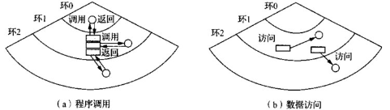

---
markmap:
    maxWidth: 500
---

# 计算机操作系统

## 操作系统引论<!-- markmap: fold -->

- 操作系统的目标：方便性、有效性、可扩充性、开放性
- 基本特性：并发、共享、虚拟、异步

## 进程的描述与控制<!-- markmap: fold -->

### 前趋图与程序执行

- 前趋图：有向无环图（DAG），用于描述进程之间执行的先后顺序。
- 程序顺序执行的特征：顺序性、封闭性、可再现性
- 程序并发执行的特征：间断性、失去封闭性、不可再现性（失去封闭性导致失去可再现性）

### 进程的描述

- 进程：进程是程序的执行过程，是系统进行资源分配和调度的一个独立单位。又称为重型进程。
    - 进程是一个可拥有资源的独立单位
    - 进程是一个可被独立调度和分派的基本单位
- 进程的基本状态：
    - 就绪态：进程已处于准备好执行的状态。即进程已分配到除 CPU 以外的所有必要资源后，只要再获得 CPU，便可立即执行
    - 执行态：进程获得 CPU 后，其程序“正在执行”这一状态
    - 阻塞态：正在执行的进程，由于发生某事件而暂时无法执行。此时会引发进程调度，OS 会把处理机分配给另一个就绪态的进程
    - 创建态：在创建进程的过程中，进程所需的资源系统尚不能满足，此时创建工作尚未完成，进程不能被调度运行的状态 
    - 终止态：当一个进程到达了自然结束的终点，或是出现了无法克服的错误，或是被 OS 所终止，或是被其他有终止权的进程所终止时的状态 

- 进程的挂起操作和进程状态的转换：引入的挂起原语和激活原语 
- 进程管理中的数据结构（PCB）
    - PCB 中的信息
        - 进程标识符：外部标识符、内部标识符
        - 处理机状态
        - 进程调度信息
        - 进程控制信息
    - 组织方式
        - 线性方式
        - 链接方式
        - 索引方式

### 线程的概念

- 线程：是程序的执行过程，是系统进行资源分配和调度的一个比进程更小的基本单位。又称为轻型进程。

!!! note "为什么要引入线程？"

    没有线程时，处理机为使程序并发执行，需要：创建进程 -> 撤销进程 -> 进程切换。进程是一个资源的拥有者，在创建、撤销和切换中，系统要付出较大的时间开销。

    引入线程后，仅需保存和设置少量寄存器的内容。

- 线程的三个状态：执行态、就绪态、阻塞态
- 线程管理中的数据结构：线程控制块（TCB），包含线程标识符、一组寄存器、线程执行状态、优先级、线程专有存储区、信号屏蔽、堆栈指针。

## 处理机调度与死锁<!-- markmap: fold -->

### 调度概述

- 调度的三个层次
    - 高级调度（长程调度、作业调度）
    - 低级调度（短程调度、进程调度）
    - 中级调度（内存调度）
- 作业和作业调度
    - 作业：包含通常的程序、数据，还包含作业说明书，系统根据说明书对程序的运行就行控制。多批道处理系统中，将作业作为基本单位从外存掉

### 调度算法

### 实时调度

### 死锁概述

- 资源：
- 死锁：
- 必要条件
    - 互斥条件
    - 请求和保持
    - 不可抢占
    - 环路等待
- 处理死锁的方法
    - 预防死锁
    - 避免死锁
    - 检测死锁
    - 解除死锁

### 预防死锁

## 进程同步<!-- markmap: fold -->

## 存储器管理<!-- markmap: fold -->

## 虚拟存储器<!-- markmap: fold -->

### 虚拟存储器概述

- 传统存储器管理方式
    - 第五章介绍的各种存储器管理方式，统称为传统存储器管理方式
    - 两个特征
        - 一次性
        - 驻留性
    - 两个缺点
        - 大作业无法全部装入内存
        - 大量作业要运行时，只能将少数作业装入运行
- 虚拟存储器
    - 利用的原理：存储器访问的局部性原理
        - 时间局部性。主要由循环造成
        - 空间局部性。主要有顺序执行和数据的聚集存放造成
    - 定义：具有**请求调入**功能和**置换功能**，能从逻辑上对内存容量加以扩充的一种存储系统
    - 优点：其逻辑容量由内存容量和外存容量之和决定。因此：
        - 运行速度接近内存速度
        - 成本接近于外存
    - 与传统存储管理方式比较，虚拟存储器具有三个重要特征：
        - 多次性
        - 对换性
        - 虚拟性
    - 实现方式
        - 请求分页系统：在分页的基础上，增加**请求调页**的功能、**页面置换**功能
        - 请求分段系统：在分段的基础上，增加了**请求调段**的功能、**分段置换**功能

### 请求分页存储管理方式

- 硬件支持
    - 请求页表机制（页表机制）
        - 基本作用：逻辑地址 $\Leftrightarrow$ 物理地址
        - 页表项：
            - 页号
            - 物理块号
            - 状态位 P，指示该页是否在内存
            - 访问字段 A，记录该页在一段时间内被访问的次数
            - 修改位 M（脏位），标记是否被修改过
            - 外存地址，指示该页在外存中的地址
    - 缺页中断机构
        - 基本作用：当要访问的页面不在内存中时，产生一个缺页中断
        - 和一般中断的区别
            - 可以在指令的执行期间产生和处理中断信号
            - 可以在一条指令的执行期间，产生多次缺页中断
        - 对硬件的要求：硬件机构应能够保存多次中断时的状态，并保证最后能够返回到中断前产生缺页中断的指令处，继续执行
    - 地址变换机构
        - 定义：在分页系统地址变换机构的基础上，为实现虚拟存储器而通过增加某些功能所形成的
        - 功能
            - 产生和处理缺页中断
            - 从内存中换处一页
        - 地址变换过程 
- 页面分配（内存分配）
    - 最小物理块的确定（保证进程正常运行，所需要的最少物理块？）
    - 内存分配策略（分配的物理块数目是固定的，还是可变的？）
        - 采取两种分配策略，即固定和可变分配策略；采取两种置换策略，即全局置换和局部置换。由此组合出以下三种适用的策略：
        - 固定分配局部置换
            - 为每个进程分配固定页数的内存空间，整个运行期间不在改变。如果在运行中发现缺页，则只能从该进程在内存的固定页面中选出一页换出，然后再调入一页。
            - 缺点：
            （1）为每个进程分配多少个页面难以确定。太少，频繁缺页中断，降低系统吞吐量。太多，内存驻留进程减少，可能造成资源空闲
            （2）实现进程对换时，会花费更多的时间
        - 可变分配全局置换
            - 先为系统中的每个进程分配一定数目的物理块，而OS自身也保持一个空闲物理块队列。当某进程发现缺页时，由系统从空闲的物理块队列中，取出一物理块分配该进程，并将欲调入的缺页装入其中。当空闲物理块用完时，OS从内存中任选一页调出(任意进程)。--可能影响其它进程运行
            - 优点：易于实现
        - 可变分配局部置换
            - 根据进程的类型或程序员的要求，为每个进程分配一定数目的内存空间。当某进程发生缺页时，只允许从该进程在内存的页面中选出一页换出，这样就不会影响其它进程运行。如果进程在运行中频繁地发生缺页中断，则系统再为该进程分配附加的物理块。若一个进程在运行中缺页频率低，则此时适当减少分配给该进程的物理块
    - 物理块分配算法（分配的物理块数，是平均分配，还是根据进程大小来分配）
        - 平均分配算法。物理块平均分配给给进程
        - 按比例分配算法。按进程大小的比例分配物理块
        - 考虑优先权的分配算法。按照作业的重要性、紧迫性进行分配
- 页面调入策略
    - 何时调入页面
        - 预调页策略。OS 猜哪些页面要被调入，预先调入
        - 👍请求调页策略。程序请求调入页面时，才调入
    - 如何调入页面
    - 缺页率
        - 若访问页面成功(在内存)的次数为S，访问页面失败(不在内存)的次数为F，则总访问次数为A=S+F
        - 缺页率：$f=F/A$
        - 影响因素:
            - 页面大小
            - 分配内存块的数目
            - 页面置换算法
            - 程序固有属性

### 页面置换算法
- 最佳置换
- 先进先出
- 最近最久未使用置换
    - 硬件支持：寄存器、栈
- 最少使用置换：简单的 Clock 置换算法、改进型 Clock 置换算法
- 页面缓冲算法

### “抖动”与工作集

- 抖动
    - 刚被调出的页面很快又被访问。CPU 把大量时间花费在页面置换上
    - 原因：
        - 系统中运行的进程太多
        - 进程分得物理块太少
        - 页面置换算法够好
    - 预防：
        - **采取局部置换策略**。在页面分配和置换策略中，如果采取的是可变分配方式，则为了预防发生“抖动”，可采取局部置换策略
        - **把工作集算法融入到处理机调度中**。当调度程序发现处理机利用率低下时，它将试图从外存调入一个新作业进入内存，来改善处理机的利用率
        - **选择暂停的进程**。当多道程序度偏高时，已影响到处理机的利用率，为了防止发生“抖动”，系统必须减少多道程序的数目
        - 利用**L=S准则**调节缺页率
- 工作集
    - 在时间段 $\Delta$ 内，进程访问的页面集合

### 请求分段存储管理方式

- 硬件支持
    - 请求段表机制
    - 缺段中断机构
    - 地址变换机构
- 分段的共享和保护
    - 共享段表
    - 共享段的分配与回收
    - 分段保护
        - 越界检查
        - 环保护机构 
        
## 输入/输出系统<!-- markmap: fold -->

### I/O 系统的功能、模型与接口

- I/O 系统的基本功能
    - 隐藏 I/O 设备的细节
    - 保证设备无关性
    - 提高处理机和 I/O 设备的利用率
    - 对 I/O 设备进行控制
    - 确保对设备的正确共享
    - 能够处理错误
- I/O 系统的层次结构与模型
    - 层次结构
        - 用户层软件。执行输入输出系统调用，对I/O数据进行格式化，为假脱机输入/输出作准备
        - 与设备无关的 I/O 软件。实现设备的命名、设备的保护、成块处理、缓冲技术和设备分配
        - 设备驱动程序。设置设备寄存器、检查设备的执行状态
        - 中断处理程序。负责I/O完成时，唤醒设备驱动程序进程，进行中断处理
        - 硬件。实现物理I/O的操作
    - I/O 系统的模型
        - I/O 系统的上/下接口
            - I/O 系统接口
            - 软件/硬件接口
        - I/O 系统的分层
            - 中断处理程序
            - 设备驱动程序
            - 与设备无关的 I/O 软件
- I/O 系统的接口
    - 块设备接口
    - 设备接口
    - 网络通信接口

### I/O 设备和设备控制器

- I/O 设备
    - I/O 设备的类型
        - 按数据组织：块设备、字符设备、非上述设备的设备
        - 按使用特性（功能特性）：存储设备、I/O 设备、数据通信设备
        - 按资源分配：独占设备、共享设备
        - 按传输速率：低速设备、中速设备、高速设备
    - 设备与设备控制器之间的接口
        - 数据信号线
        - 控制信号线
        - 状态信号线
- 设备控制器 
    - 设备控制器的功能
        - 接收、识别命令
        - *数据交换
        - 标志和报告设备状态
        - *地址译码
        - *数据缓冲区
        - 差错控制
        - *数模/模数转换
    - 设备控制器的组成
        - 设备控制器与 CPU 的接口
        - 设备控制器与设备的接口
        - I/O 逻辑
- 内存映射 I/O（I/O 端口编址）
    - 内存映射编址
    - I/O 独立编址
    - 混合方案：具有内存映射 I/O 的数据缓冲区，而控制/状态寄存器则具有单独的 I/O 端口
- I/O 控制方式
    - 程序控制 I/O（使用轮询的可编程 I/O 方式）
    - 中断驱动 I/O（使用中断的可编程 I/O 方式）
    - DMA
    - 通道

### 中断和中断处理程序

- 中断应该深深隐藏在操作系统内部。隐藏的办法是每个进程在启动一个I/O操作后阻塞，直到I/O操作完成并产生一个中断由操作系统接管CPU后唤醒该进程为止
- 驱动程序发送控制命令后，阻塞自己
    - 在信号量上执行P操作
    - 在条件变量上执行wait操作
    - 在消息上执行receive操作
- 中断发生时，中断处理程序将对中断进行处理，然后将启动被阻塞的驱动程序解除阻塞
    - 在信号量上执行V操作
    - 在条件变量上执行signal操作
    - 在消息上执行send操作
    
### 设备驱动程序

- 与设备密切相关的代码放在设备驱动程序中，每个设备驱动程序处理一种设备类型
- 每一个控制器都设有一个或多个设备寄存器，用来存放向设备发送的命令和参数
- 设备驱动程序负责下达这些命令，并监督它们正确执行
- 设备驱动程序的任务是接收来自与设备无关的上层软件的抽象请求，并执行这个请求
- 在设备驱动程序的进程发出一条或多条命令后，系统有两种处理方式，多数情况下，执行设备驱动程序的进程必须等待命令完成，这样，在命令开始执行后，它阻塞自已，直到中断处理时将它解除阻塞为止
- 另一些情况下，命令执行不必延迟就很快完成

### 与设备无关的I/O软件

- 功能
    - 设备驱动程序的统一接口
    - 缓冲 
    - 错误报告
    - 分配与释放专用设备
    - 提供与设备无关的块大小
- 设备独立性：使用户/程序员可以访问任何 I/O 设备，而无需实现指定设备
- 统一命名：对 I/O 设备采用与文件统一的命名方式，所有文件和设备都使用相同的方式，然后通过路径名进行寻址
- 错误处理：错误应该在尽可能靠近硬件的层面得到处理。在很多情况下，错误处理可以在低层透明地得到解决，高层软件甚至不知道存在这一错误
- 同步、异步传输：同步传输为阻塞式传输，异步传输为非阻塞式(中断驱动)传输

### 用户层的 I/O 软件

- 尽管大部分I/O软件都包含在操作系统中，但仍有一小部分是由与用户程序连接在一起的库过程，甚至完全由运行于内核外的程序构成
- 系统调用，包括I/O系统调用，通常由库过程实现
- 这些过程所做的工作只是将系统调用时所用的参数放在合适的位置，由其它的I/O过程实际实现真正的操作
- 共享设备与独占设备
    - 共享设备每次只能分配给一个进程使用
    - 共享设备是可由若干个进程同时共享的设备
- SPOOLing（假脱机技术）
    - 磁盘缓冲区
    - 打印缓冲区
    - 假脱机管理进程和假脱机打印进程

### 缓冲区管理

- 缓冲技术
    - 无缓冲
    - 单缓冲
    - 多缓冲

### 磁盘性能概述和磁盘调度

- 磁盘组织成许多柱面，每一个柱面上的磁道数和垂直放置的磁头个数相同
- 磁道又被分成许多扇区，每条磁道上扇区数目典型为8至32
- 每个扇区包含相同的字节数 
- 磁盘 I/O 访问时间
    - 寻道时间 $T_s$：磁头移动到指定柱面的机械运动时间，通常每个柱面移动需要10ms左右
    - 旋转延迟时间 $T_r$：等待指定扇区旋转到磁头下的机械运动时间。它与磁盘转速相关，例如某硬盘转速为7200rpm，则$T_r$=4.17ms
    - 实际数据传输时间 $T_t$：数据读写的时间，与读写的字节数和磁盘转速有关
- 磁盘臂调度算法
    - 先来先服务（FCFS）
    - 最短寻道时间优先（SSTF）
    - 电梯算法
    - 单向扫描算法
- 廉价磁盘冗余阵列：RAID(Redundant Array of Independent Disk) 是利用一台磁盘阵列控制器，统一管理和控制一组磁盘驱动器，组成一个速度快、可靠性高、性能价格比好的大容量磁盘系统
    - RAID共有6级组成，RAID0 ~ RAID5，其中RAID0无校验；RAID1 ~ RAID5的区别仅是实现冗余校验的方法不同
    - RAID 0 
    - RAID 1 
    - RAID 2 
    - RAID 3 
    - RAID 4 
    - RAID 5 

## 文件管理<!-- markmap: fold -->

### 文件和文件系统

### 文件的逻辑结构

### 文件目录

### 文件共享

### 文件保护