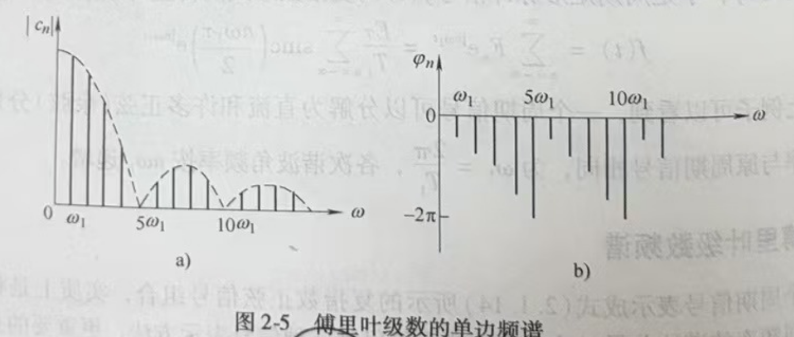
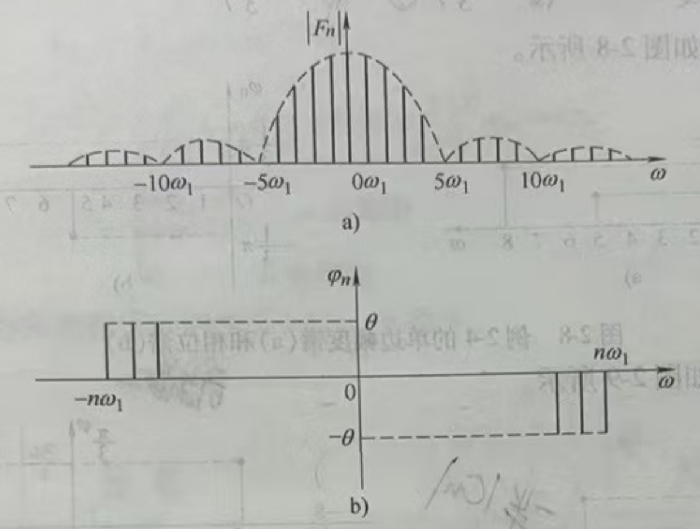
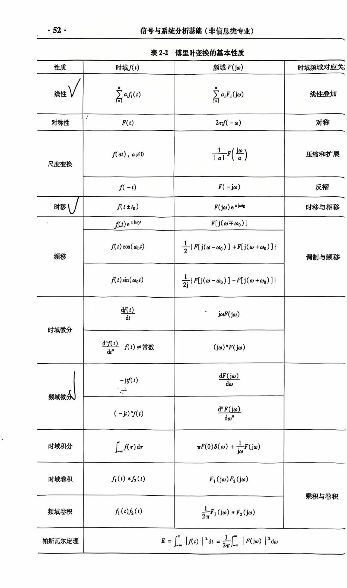
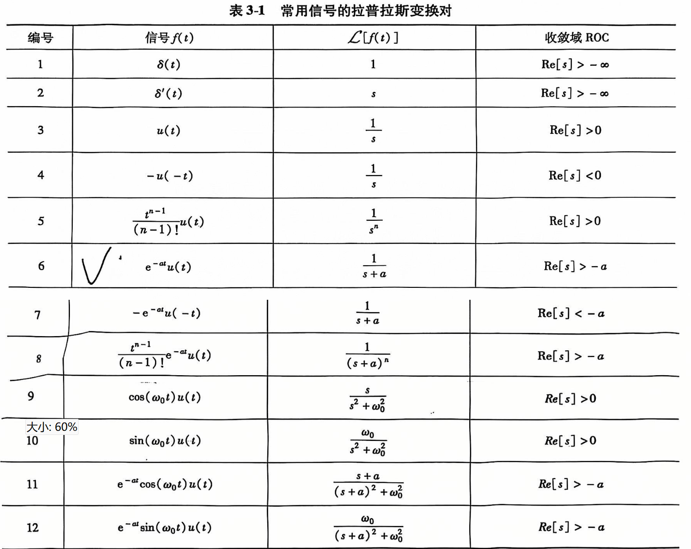
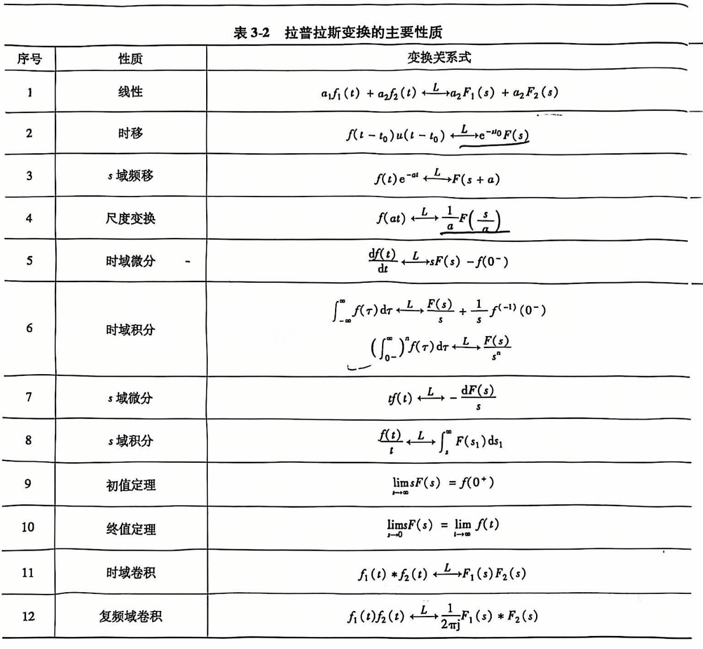
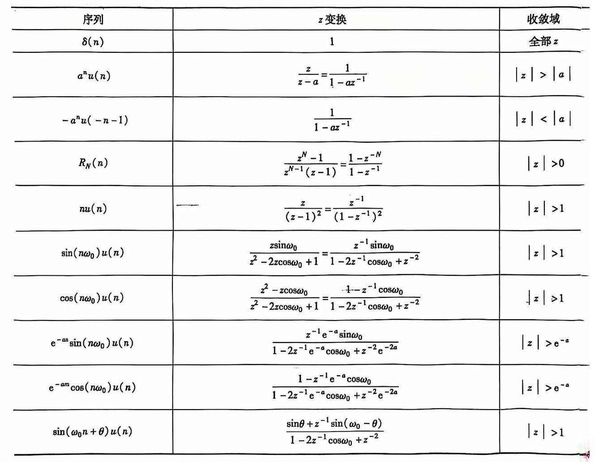
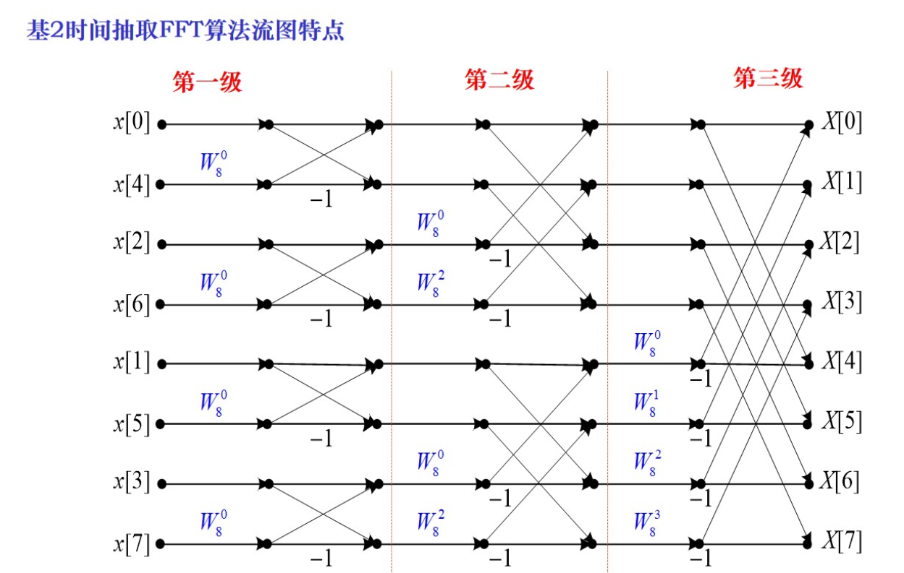

# 信号分析基础

## 信号与系统的基本概念
- 信号定义：信号是信息的载体，信息是信号的内涵。
- 信号的分类：
    - 连续时间信号 - 离散时间序列
    - 周期信号 - 非周期信号
    - 确定性信号 - 随机信号
    - 能量信号 - 功率信号。能量信号绝对平方可积（和），否则称为功率信号。
    - 因果信号 - 反因果信号。**右边信号**就是**因果信号**，**左边信号**就是**反因果信号**。
- 连续与离散信号的运算：
    - 反褶
    - 移位
    - 尺度变换
    - 加、减、乘、标量乘
    - 差分运算：向前差分：$\nabla x[n] = x[n+1] - x[n]$；向后差分：$\Delta x[n] = x[n] - x[n-1]$。且 $\nabla x[n] = \Delta x[n-1]$。
    - 卷积运算：连续信号的卷积分：$\int_{-\infty}^{\infty} f_1(\tau) f_2(t-\tau) d\tau$；离散信号的卷积：$x[n] * y[n] = \sum_{k=-\infty}^{\infty} x[k] y[n-k]$。卷积运算的性质：交换律、分配律、结合律。
- 常见的信号序列：
    - 正弦类：$f(t)=A\cos(\omega t+\varphi)$。根据欧拉恒等式，正弦函数信号可以写为：$\sin(\omega t) = \frac{e^{j\omega t}-e^{-j\omega t}}{2j}$，$\cos(\omega t) = \frac{e^{j\omega t}+e^{-j\omega t}}{2}$。
    - 指数类：$f(t)=Ae^{st}$。根据欧拉等式，指数函数信号可以写为：$e^{j\omega t} = \cos(\omega t) + j\sin(\omega t)$。
    - 单位冲激信号：$\boxed{f(t)=\delta(t)=\begin{cases} \infty & t = 0\\0 & t\neq 0\end{cases}}$ 且有 $\boxed{\int_{-\infty}^{\infty} \delta(t) dt=1}$，且有如下筛选特性：$\int_{-\infty}^{\infty}f\left(t\right)\delta\left(t\right)dt=\int_{0-}^{0+}f\left(t\right)\delta\left(t\right)dt=f\left(0\right)\int_{0-}^{0+}\delta\left(t\right)dt=f\left(0\right)$
    - 单位阶跃信号：$\boxed{f(t)=u(t)=\begin{cases} 1 & t > 0\\0 & t < 0\end{cases}}$.
    - 门函数：$\boxed{\prod(\frac{t}{\tau}) = u(t+\frac{\tau}{2}) - u(t-\frac{\tau}{2}) = \begin{cases} 1 & |t| < \frac{\tau}{2} \\ 0 & others \end{cases}}$；矩形序列：$R_N(n) = \begin{cases} 1 & 0\leq n\leq N-1 \\ 0 & others \end{cases}$。
    - 内插函数信号（辛格函数）：$sinc(x) = \frac{\sin(x)}{x}$。
- 系统：
    - 直接理解成这个就行：$y(t)=T[x(t)]$
    - **连续系统与离散系统**
    - **线性系统与非线性系统**。线性系统要满足**可加性**和**比例性**，即：$T[x_1(t)+x_2(t)]=T[x_1(t)]+T[x_2(t)]$、$T[a_1x_1(t)]=a_1y_1(t)$。一般来说，带常数就不是线性系统，同时不满足比例性和可加性。
    - **时变系统与时不变系统**。时不变系统要满足 $T[x(t-t_0)]=y(t-t_0)$ 或 $T[x(n-m)]=y(n-m)$
    - 判断线性、时不变性的关键点在于，套用公式时，**要明确是对 $x(t)$ 或 $x(n)$ 进行变换（即 $T[x(t)]$ 或 $T[x(n)]$），还是对 $t$ 或 $n$ 进行变换（即 $y(t)$ 或 $y(n)$）**。
    - 同时具有**线性**和**时不变性**的系统成为**线性时不变系统**，也即 **LTI 系统**
    - **因果系统与非因果系统**。如果输出取决于**未来的输入**则成为非因果系统。非因果系统是不可物理实现的
    - **稳定系统**。输入有界且输出也有界，称为稳定系统，否则称为不稳定系统
    - **零输入响应**：**输入信号为零**，仅由**系统初始状态**(系统没有外部激励时系统的固有状态)单独作
    用于系统而产生的输出响应，用 $y_{zi}(t)$ 表示
    - **零状态响应**：忽略系统的初始状态，**只由外部激励**作用于系统而产生的输出响应，用 $y_{zs}(t)$ 表示
    - **全响应**：$y_{zi}(t) + y_{zs}(t)$
        
## 连续信号的傅里叶变换
#### 傅里叶级数

]

- **三角形式的傅里叶级数**：$\boxed{f\left(t\right)=a_{0}+\sum_{n=1}^{\infty}\left(a_{n}\cos n\omega_{1}t+b_{n}\sin n\omega_{1}t\right)}$；余弦形式：$f\left(t\right)=c_{0}+\sum_{n=1}^{\infty}c_{n}\cos\left(n\omega_{1}t+\varphi_{n}\right)$；正弦形式：$f\left(t\right)=d_{0}+\sum_{n=1}^{\infty}d_{n}\sin\left(n\omega_{1}t+\theta_{n}\right)$
- 直流分量：$a_{0}=\frac{1}{T_{1}}\int_{0}^{T_{1}}f\left(t\right)dt=\frac{1}{T_{1}}\int_{-\frac{T_{1}}{2}}^{\frac{T_{1}}{2}}f\left(t\right)dt$
- 余弦分量系数：$a_{n}=\frac{2}{T_{1}}\int_{0}^{T_{1}}f\left(t\right)\cos n\omega_{1}tdt=\frac{2}{T_{1}}\int_{-\frac{T_{1}}{2}}^{\frac{T_{1}}{2}}f\left(t\right)\cos n\omega_{1}tdt$
- 正弦分量系数：$b_{n}=\frac{2}{T_{1}}\int_{0}^{T_{1}}f\left(t\right)\mathrm{sin}n\omega_{1}t\mathrm{d}t=\frac{2}{T_{1}}\int_{-\frac{T_{1}}{2}}^{\frac{T_{1}}{2}}f\left(t\right)\mathrm{sin}n\omega_{1}t\mathrm{d}t$
- 各项关系，其中（$n=1,2,\cdots$）：$\begin{cases}
                & a_{0}=c_{0}=d_{0} \\
                & c_{n}=d_{n}=\sqrt{a_{n}^{2}+b_{n}^{2}} \\
                & a_{n}=c_{n}\mathrm{cos}\varphi_{n}=d_{n}\mathrm{sin}\theta_{n} \\
                & b_{n}=-c_{n}\mathrm{sin}\varphi_{n}=d_{n}\mathrm{cos}\theta_{n} \\
                & \tan\theta_{n}=\frac{a_{n}}{b_{n}} \\
                & \tan\varphi_{n}=-\frac{b_{n}}{a_{n}}
                \end{cases}$
- **复指数形式的傅里叶级数**：$\boxed{f(t)=\sum_{n=-\infty}^{\infty}F_{n}e^{jn\omega_{1}t}}$，其中 $F_{n}=\frac{1}{T_{1}}\int_{0}^{T_{1}}f\left(t\right)e^{-jn\omega_{1}t}dt=\frac{1}{T_{1}}\int_{-\frac{T_{1}}{2}}^{\frac{T_{1}}{2}}f\left(t\right)e^{-jn\omega_{1}t}dt$
- 周期信号的实质：**一个周期信号由不同频率的谐波分量所组成**。什么是*谐波*？可以简单理解为能够使用公式表达的、和谐的、规律的波形
- 傅里叶级数的频谱分为**幅度谱**和**相位谱**，分别对应幅频特性和相频特性
- **从傅里叶级数三角形式导出的单边频谱**。幅频特性：$\left|c_{n}\right|=\sqrt{a_{n}^{2}+b_{n}^{2}}$；相频特性：$\varphi_{n}=\arctan\left(\frac{-b_{n}}{a_{n}}\right)$
- **从傅里叶级数复指数形式导出的双边频谱** 幅频特性：$\left|F_{n}\right|=\left|\frac{a_{n}-jb_{n}}{2}\right|=\frac{1}{2}\sqrt{a_{n}^{2}+b_{n}^{2}}$；相频特性：$\varphi_{n}=\arctan\left(\frac{-b_{n}}{a_{n}}\right)$
- 双边频谱虽然有负频率，但负频率的出现完全是数学运算的结果，并没有任何物理意义
- 周期信号频谱的特点：离散性、谐波性、收敛性

#### 傅里叶变换
- 正变换：$\boxed{F\left(j\omega\right)=\mathcal{F}\left[f\left(t\right)\right]=\int_{-\infty}^{\infty}f\left(t\right)e^{-j\omega t}dt}$
- 逆变换：$\boxed{f\left(t\right)=\mathcal{F}^{-1}\left[F\left(j\omega\right)\right]=\frac{1}{2\pi}\int_{-\infty}^{\infty}F\left(j\omega\right)e^{j\omega t}d\omega}$
- 傅里叶变换是一对线性变换，它们之间存在一一对应的关系
- 傅里叶级数分析对象是**周期信号**，傅里叶变换分析对象是**非周期信号**
- 傅里叶级数频率定义域是**离散频率、谐波频率处**，傅里叶变换频率定义域是**连续频率、整个频率轴**
- 傅里叶级数函数值意义是频率分量的**数值**，傅里叶变换函数值意义是频率分量的**密度值**
- 函数存在傅里叶变换的**充分**条件：$\int_{-\infty}^{\infty}|f\left(t\right)|dt<\infty$
- 根据欧拉恒等式：$F\left(j\omega\right)=\int_{-\infty}^{\infty}f\left(t\right)e^{-j\omega t}dt=\int_{-\infty}^{\infty}f\left(t\right)\cos\left(\omega t\right)dt-j\int_{-\infty}^{\infty}f\left(t\right)\sin\left(\omega t\right)dt$
- 由上式：$\begin{cases}R\left(\omega\right)=\int_{-\infty}^{\infty}f\left(t\right)\cos\left(\omega t\right)dt \\X\left(\omega\right)=-\int_{-\infty}^{\infty}f\left(t\right)\sin\left(\omega t\right)dt & \end{cases}$
- 由上式：$\boxed{\begin{cases}|F\left(j\omega\right)|=\sqrt{R^{2}\left(\omega\right)+X^{2}\left(\omega\right)} \\ \varphi\left(\omega\right)=\arctan=\frac{X\left(\omega\right)}{R\left(\omega\right)} & \end{cases}}$
- 由上式：$|F\left(j\omega\right)|$ 是**偶函数**，$\varphi\left(\omega\right)$ 是**奇函数**
- 如果信号 $f(t)$ 的傅里叶变换 $F($j$\omega )$ 当 $\omega>\omega_\mathrm{m}$ 时均为零，则称$f(t)$是带限的，正实数 $\omega_m$ 称为信号 $f({t})$ 的带宽
- 如果信号 $f(t)$ 存在一个正实数 $T_\mathrm{m}$，当$|t|>T_\mathrm{m}$ 时，$f(t)=0$，则该信号是时限的，它对应于频域有一个时宽$T_{\mathrm{m}}$
- 带限信号在时域上是无限连续时间的，即**带限信号不能是时限**的；相应地，**时限信号必然是无限带宽的**
- 典型傅里叶变换对：    
    - 门信号：$\boxed{\Pi\left(\frac{t}{\tau}\right)\xleftrightarrow{F}\tau\sin c\left(\frac{\omega\tau}{2}\right)}$
    - 单边指数信号：$\boxed{e^{-at}u\left(t\right)\xleftrightarrow{F}\frac{1}{a+j\omega}}$
    - 双边指数信号：$\boxed{e^{-a|t|}\left(a>0\right)\xleftrightarrow{F}\frac{2a}{a^{2}+\omega^{2}}}$
    - 单位冲激信号：$\boxed{\delta (t)\xleftrightarrow{F}1}$
    - 直流信号 $f(t)=E$：$\boxed{E\xleftrightarrow{F}2\pi E\delta(\omega)}$
    - 符号函数：$sgn(t)\xleftrightarrow{F}\frac{2}{j\omega}$
    - 单位阶跃信号：$\boxed{u(t) \xleftrightarrow{F} \pi\delta(\omega)+\frac{1}{j\omega}}$
        

#### 傅里叶变换的基本性质

#### 周期信号的傅里叶变换
- 直接使用傅里叶变换的定义的前提条件是要满足**绝对可积**，但周期信号并不满足绝对可积的条件。而引入**奇异函数**后，某些不满足绝对可积的信号也可以求傅里叶变换，所以有这一节。
- 周期信号的傅里叶变换公式：$F\left(j\omega\right)=2\pi\sum_{n=-\infty}^{\infty}F_{n}\delta\left(\omega-n\omega_{1}\right)=\omega_{1}\sum_{n=-\infty}^{\infty}F_{0}\left(jn\omega_{1}\right)\delta\left(\omega-n\omega_{1}\right)$
- 余弦函数的傅里叶变换：$\mathcal{F}\left[\cos\left(\omega_{0}t\right)\right]=\pi\left[\delta\left(\omega-\omega_{0}\right)+\delta\left(\omega+\omega_{0}\right)\right]$
- 正弦函数的傅里叶变换：$\mathcal{F}\left[\sin\left(\omega_{0}t\right)\right]=\frac{\pi}{j}\left[\delta\left(\omega-\omega_{0}\right)-\delta\left(\omega+\omega_{0}\right)\right]$
- 周期单位冲击序列的傅里叶变换：$\mathcal{F}[\delta_{\omega 1}(\omega)] = \omega_{1}\delta_{\omega 1}(\omega)$
- 周期矩形脉冲序列的傅里叶变换：$E\tau\omega_{1}\sum_{n=-\infty}^{\infty}sinc\left(\frac{n\omega_{1}\tau}{2}\right)\delta\left(\omega-n\omega_{1}\right)$；其傅里叶系数：$F_{n}=\frac{1}{T}F_{0}\left(jn\omega_{1}\right)=\frac{E\tau}{T}sinc\left(\frac{n\omega_{1}\tau}{2}\right)$

#### 抽样信号的傅里叶变换
- 时域抽样定理（奈奎斯特定理）：一个频带受限的信号 $f(t)$，要想抽样后能够不失真地还原出原信号，抽样频率必须大于 2 倍信号谱的最高频率。

## 连续信号的拉普拉斯变换

#### 拉普拉斯变换的定义及收敛域
- 为什么要有拉普拉斯变换：傅里叶变换需要满足绝对可积的先决条件，为不收敛的函数乘上收敛因子后，就可以满足这一条件。而乘上收敛因子再求其傅里叶变换的过程，就可以视为拉普拉斯变换。
- 求法：$\begin{cases} F\left(s\right)=\int_{-\infty}^{\infty}f\left(t\right)e^{-st}dt \\ f\left(t\right)=\frac{1}{2\pi j}\int_{\sigma-j\infty}^{\sigma+j\infty}F\left(s\right)e^{st}ds & \end{cases}$
- 收敛域：右边信号（$\sigma > \sigma_1$）、左边信号（$\sigma < \sigma_2$）、双边信号（$\sigma_1 < \sigma < \sigma_2$）、时限信号（整个 s 平面）

#### 单边拉普拉斯变换的性质

#### 单边拉普拉斯的逆变换
- 查表法
- 部分分式展开法
    - 分母的所有根均为单实根：分式划开，各部查表
    - 分母的根具有共轭复根且无重复根
    - 分母仅有重根
    
#### 连续时间系统的 s 域分析
- 系统函数 $H(s)$：$H(s)=\frac{Y_{ZS}(s)}{X(s)}$，它与系统的输入和输出无关，描述了系统本身的特性。一旦系统的拓扑结构已定，它也就确定了，**它存在的条件是系统的起始状态为零，即 $y_{zi(0)=0}$**。
- 线性系统的稳定性：一个系统受某种干扰信号作用时，其所引起的系统响应在干扰消失后，会最终消失，即系统可以回到干扰作用前的状态，称系统是稳定的。
- 对于一般系统，系统稳定的充要条件是冲击响应 $h(t)$ 绝对可积。
- 系统稳定性结论：
    - 稳定：*$H(s)$ 的全部极点位于 $s$ 域的左半平面*
    - 临界稳定：*$H(s)$ 在虚轴上有 $p=0$ 的单极点或一对共轭单极点，其余极点全在 $s$ 域的左半平面*
    - 不稳定：*$H(s)$ 只要有一个极点位于 $s$ 域的右半平面，或在虚轴上有二阶或二阶以上的重极点，则系统不稳定。*
    

## 离散信号与系统

#### z 变换
- $\boxed{X\left(z\right)=\sum_{-\infty}^{\infty}x\left(n\right)z^{-n}}$，其中 $z = e^{s}$
- 级数判断敛散性的两个方法：
    - $\rho=\lim_{n\to\infty}\left|\frac{a_{n+1}}{a_{n}}\right|$
    - $\eta=\lim_{n\to\infty}\sqrt[n]{\left|a_{n}\right|}$

- z 变换的收敛域：
    - 有限长序列：$0<|z|<\infty$，但两边是否能取等号要看情况，如果求和下界小于零，则不能取无穷的等号；求和上界大于零则不能取零的等号
    - 右边序列：$|z|>\lim\limits_{n\to\infty}\sqrt[n]{|x\left(n\right)|}=R_{x1}$
    - 左边序列：$|z|<\frac{1}{\lim\limits_{n\to\infty}\sqrt[n]{\left|x\left(-n\right)\right|}}=R_{x2}$
    - 双边序列：$R_{x1}<|z|<R_{x2}$
    

#### z 逆变换

## 离散傅里叶变换

## 快速傅里叶变换

#### 按时间抽取的基-2FFT算法

- 正常算法的时间复杂度：$N^2$
- 本算法和按频率抽取的基-2FFT算法的复杂度：$\frac{N}{2}\mathrm{log}_2N$

#### 按频率抽取的基-2FFT算法

#### 逆快速傅里叶变换

- $x[k]=\frac{1}{N}\left(\mathrm{DFT}\{X^*[m]\}\right)^*$
- 意即：将 $X[m]$ 选取共轭，用 $FFT$ 流图计算 $DFT\{X^*[m]\}$，再取共轭并除以 $N$

