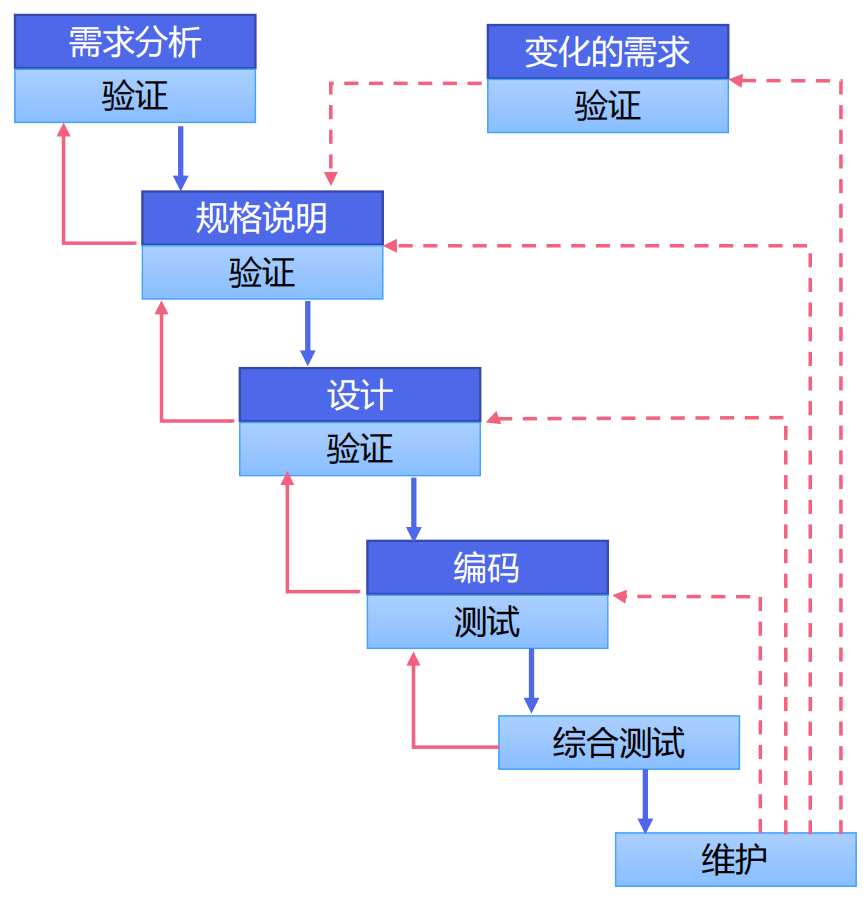
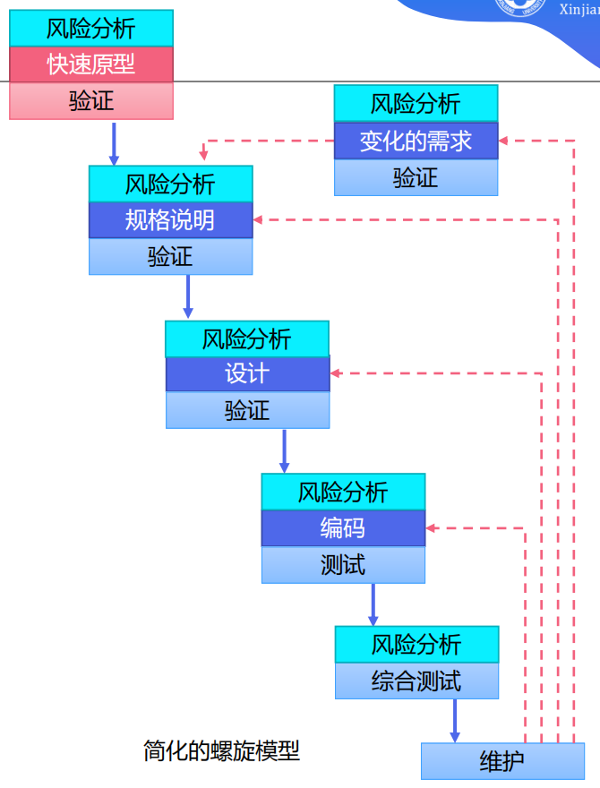
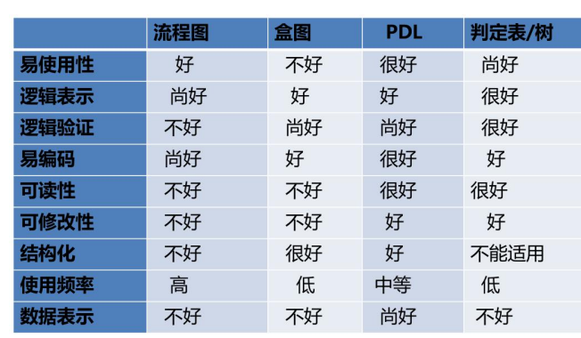
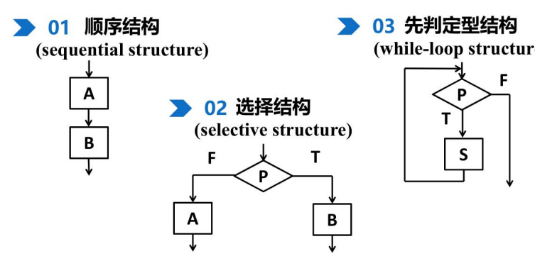
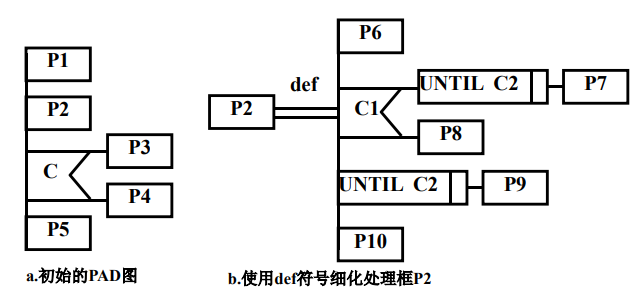
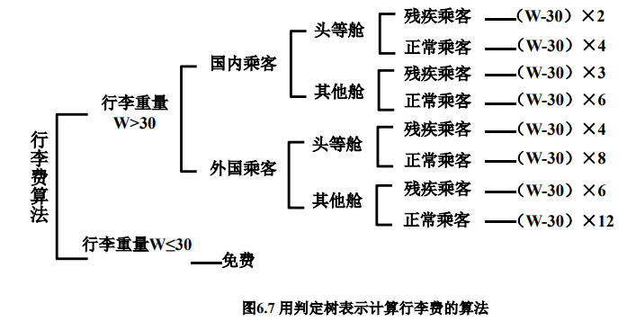
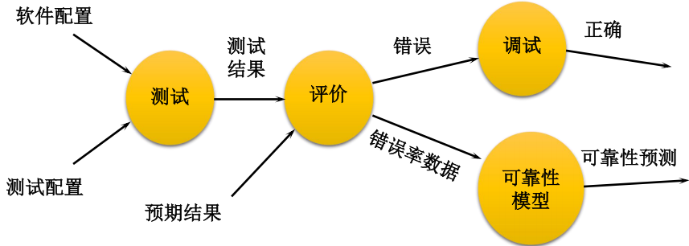

# 软件工程笔记

## 软件工程概论

- 软件的概念：软件 = 程序 + 数据 + 文档
- 软件的分类：系统软件、支撑软件、应用软件
- 软件危机

- **定义** 是指导计算机软件开发和维护的一门工程学科
- **软件工程三要素** 方法、工具、过程
- **软件生命周期** 软件定义（问题定义、可行性研究、需求分析）、软件开发（总体设计、详细设计、编码和单元测试、综合测试）、运行维护（维护）
- **软件维护分类** 预防性维护、改正性维护、适应性维护、完善性维护
- **[重要] 软件过程** 
    - 瀑布模型：
    - V 模型：
    - W 模型：
    - 快速原型模型：
    - 增量模型：
    - 螺旋模型 强调**风险分析**：
    - 喷泉模型 面向对象模型，联想一下瀑布模型，刚好相反：
    - Rational 统一过程 面向对象模型
    - 敏捷过程与极限编程
    - 微软过程
    - `PSP/TSP`

## 可行性研究

- 回答：**所有定义的问题都有解决办法吗？**
- 目的：最小代价、最短时间确定问题是否有解、值得解
- 三行：技术可行性、经济可行性、操作可行性
- 系统流程图

- 数据流图

- 数据字典：对数据流图中包含的所有元素的定义的**集合**。定义 4 类元素：数据流、数据元素、数据存储、处理
> **数据字典定义实例**
>
> 数据元素编号：DC001
>
> 数据元素名称：考试成绩
> 
> 别名：成绩、分数
>
> 简述：学生考试成绩，分五个等级
>
> 类型长度：两个字节，字符类型
>
> 取值/含义：优 [90-100]，良 [80-89]，中 [70-79]，及格 [60-69]，不及格 [0-59]
> 有关数据项或结构：学生成绩档案
>
> 有关处理逻辑：计算成绩
- 成本/效益分析
> 成本估计：代码行技术（软件成本 = 每行代码的平均成本 × 估计的源代码总行数）、任务分解技术、自动估计成本技术
>
> 成本估计的经验模型：1978年 `Putnam` 提出的，一种动态多变量模型。 $L=C_k\cdot K^{1/3} \cdot t_d^{4/3}$
>
> 成本估计模型：`COCOMO` 模型（基本 `COCOMO` 模型、中级 `COCOMO` 模型、详细 `COCOMO` 模型）），这模型是精确的、定量的好模型。在这里项目的开发类型分为 3 种：组织型、嵌入型、半独立型。

## 需求分析

- 目的：准确回答**系统必须做什么**
- 输出：经过审查的《软件需求规格说明书》
- 数据模型（E-R 图）&rArr; 功能模型（数据流图）&rArr; 行为模型（状态图）
- 需求分析的任务：
    - 确定综合要求：功能需求、性能需求、可靠性和可用性需求、出错处理需求、接口需求、约束、逆向需求、将来可能提出的要求
    - 分析数据要求：建立数据模型如数据字典
    - 导出逻辑模型：状态转换图、数据流图、实体关系图、数据字典、数据处理算法
    - 修正开发计划：深度了解用户需求，找出目前设计的不足
- 分析建模与规格说明
    - 分析建模：数据模型（E-R 图）&rArr; 功能模型（数据流图）&rArr; 行为模型（状态图）
    - 软件需求规格说明：自然语言
- 数据规范化 选第三范式就行
- 状态转换图
    - 包含**事件、状态、行为**
    - 例子：
    
- 其他图形工具 层次方框图、Warnier 图、IPO 图
- 验证软件需求
    - 一致性
    - 完整性
    - 现实性
    - 有效性

## 概要设计

#### 目的 

决定**怎样做**

#### 任务

- 划分组成系统的物理元素
- 设计软件结构

#### 必要性

可以站在全局高度上，花较小的成本，从较抽象的层次上分析对比多种可能的系统实现方案和软件结构，从中选择出最佳的方案和最合理的软件结构，从而用较低的软件成本开发出高质量的软件系统。

#### 设计过程

- 系统设计阶段
- 结构设计阶段

#### 设计原理

- 模块化
- 抽象
- 逐步求精
- 信息隐藏和局部化
- 模块独立 
    - 耦合 无直接耦合、数据耦合、标记耦合、控制耦合、外部耦合、公共耦合、内容耦合
    - 内聚 偶然性内聚、逻辑性内聚、时间内聚、过程内聚、通信内聚、顺序内聚、功能性内聚

#### 启发规则

- 改进软件结构提高模块独立性
- 模块规模应该适中
- 深度、宽度、扇出、扇入应适当
    - 深度 软件结构中控制的层数
    - 宽度 软件结构内同一个层次上的模块总数的最大值
    - 扇出 一个模块直接控制的模块数目
    - 扇入 一个模块被多少个上级模块直接调用的数目
- 模块的**作用域应在控制域之内**，怎样修改才能做到这点
    - 把判定点上移
    - 把在作用域内但不在控制域内的模块移动到控制域内
- 力争降低模块接口的复杂度
- 设计单入口单出口的模块
- 模块功能可以预测
#### 描绘软件结构的图形工具
  - 层次图和 `HIPO` 图：
  - 结构图：
#### 面向数据流的设计方法
- 概念
    - **变换流** 信息沿输入通路进入系统，由外部形式变换为内部形式，经过处理后输出到输出通路
    - **事务流** 数据是**以事务为中心的**，数据沿输入通路到达一个处理 $T$，这个处理根据输入数据的类型在若干个动作序列中选出一个来执行
    - 设计过程 
- 变换分析 是一系列设计步骤的总称，经过这些步骤把具有变换流特点的**数据流图**按预先确定的模式映射成软件结构
- 事务分析 数据流具有明显的**事务特点**（指有一个明显的事务中心，如 ATM 机）时采用事务分析方法。该方法和变换分析的主要差别是**数据流图到软件结构的映射方法不同**。
- 设计优化
    - 在不考虑时间因素的前提下开发并精化软件
    - 在详细设计阶段选出最耗费时间的模块，仔细地设计它们的算法
    - 使用高级程序设计语言编写程序
    - 孤立出大量占用机器资源的模块
    - 必要时重写占用大量机器资源的模块

## 详细设计

#### 目的

回答**具体该如何设计软件**。它不是具体地编写程序，而是设计程序的**蓝图**。

#### 程序结构设计

- 概念 一种设计程序的技术，采用**自顶向下、逐步求精**的设计方法，和**单入口、单出口**的控制接口。
- 控制结构
    - **函数结点** 结点有一个入口线和一个出口线
    - **谓词结点** 结点有**一**个入口线和**两**个出口线，而且它**不改变**程序的数据项的值
    - **汇点** 结点有多个（$\geq 2$）入口线和一个出口线，而且它不执行任何运算
- 正规程序
    - **定义** 具有一个入口线、一个出口线。且对于每个结点，都有一条从入口线到出口线的通路通过该结点
- 正规子程序
    - **定义** 一个正规程序的某个部分仍然是正规程序，那么称它为该正规程序的正规子程序
- 基本程序
    - 定义 如果存在**封闭结构**，封闭结构都是正规程序，且不包括多于一个结点的正规子程序（即它是一种不可再分解的正规程序）
    - 两个结点之间所有**没有重复结点**的通路组成的结构称为**封闭结构**：
    - 三种基本控制结构（顺序结构、选择结构、循环结构）和两个扩充控制结构（多分支结构、UNTIL循环结构）都是基本程序
    - 用以构造程序的基本程序的集合称为**基集合**
    - 如果一个基本程序的函数结点用另一个基本函数程序替换，产生的新的正规程序称为**复合程序**
    - 由基本程序的一个固定的基集合构造出的复合程序，称为**结构化程序**
    - **结构化定理** 任一正规程序都可以函数等价于一个由基集合{顺序，If-else-then，While-do}产生的结构化程序
    - 结构化步骤 给函数结点和谓词结点**编号** &rarr; 函数结点**加出口赋值块** &rarr; 谓词结点**加出口赋值块并汇合** &rarr; 构造循环体：
    - **总结** 看了半天终于懂了这 SB PPT 在讲啥，其实很简单：把所有的函数结点和谓词结点编号，这些结点（包括函数和谓词）下一步去哪个结点也记一下，搞一个 SB 变量 L（代表第 $i$ 个结点），暴力弄一堆判断判断 L = 1/2/3/4/5……，最 SB 的来了，每个 L 下面都挂一个结点，出口拉回去就行。如图：

#### 人机界面设计
- 必须考虑的四个问题：
    - 系统响应时间 指从用户完成某个动作（按回车键或点击鼠标），到系统给出响应之间的时间间隔
    - 用户帮助设施
    - 出错信息处理
    - 命令交互

#### 过程设计工具

- 程序流程图（Flowchart）

- 盒图（N-S）

- PAD 图

- 判定表

- 判断树

- 过程设计语言（Procedure Design Languag）

#### 面向数据结构的设计方法

- Jackson 图

- 改进的 Jackson 图

- Jackson 方法
    - 目标 得出对程序处理过程的详细描述
    - 步骤
        - tmd 有点麻烦啊，做题遇到了再来完善，感觉不考
#### 程序复杂程度的定量度量
- McCabe
    - 流图 “退化”的程序流程图，仅描绘程序的控制流程，不表现对数据的具体操作及循环、选择的条件。
    - 环形复杂度 $V(G)$ = 流图中的区域数；
    - [最准] 环形复杂度 $V(G)$ ＝ 边－点 + 2
    - 环形复杂度 $V(G)$ ＝ 判定结点＋1
    - 实践表明，模块规模以 $V(G)\leq 10$ 为宜。
- Halstead 方法
    - 程序长度 = 程序中运算符出现的总次数 + 操作数出现的总次数
    - 预测程序长度 = $n_1\log_2{n_1}+n_2\log_2{n_2}$，其中 $n_1$ 为的不同运算符（包括关键字）的个数，$n_2$ 为不同操作数（变量和常量）的个数。
    - 预测错误个数 $E = N \log_2{(n1+n2)} / 3000$

## 软件实现
- 编码：把软件设计结果翻译成程序
- 测试：检测程序并改正错误的过程
- 编码和测试统称为**实现**

#### 编码

- 选择程序设计语言
- 编码风格
    - 文档
    - 数据说明
    - 语句构造
    - 输入/输出
    - 效率
        - 程序运行时间
        - 存储器效率
        - 输入/输出效率

#### 软件测试基础

- 软件测试的目标
    - 测试是为了发现程序中的错误
    - 好的测试是极可能发现迄今为止尚未发现的错误
    - 成功的测试是发现了至今为止尚未发现的错误
- 测试的定义：为了发现程序中的错误而执行程序的过程
- 软件测试准则
    - 所有测试都应该能追溯到用户需求
    - 应该远在测试前就制定出测试计划
    - 把 Pareto 原理应用到软件测试中
    - 应该从“小规模”测试开始，并逐步进行“大规模”测试
    - 穷举测试是不可能的；因此，测试只能证明程序中有错误，不能证明程序中没有错误
    - 为了达到最佳测试效果，应该由独立的第三方从事测试工作
- 测试方法
    - 黑盒测试（也称功能测试） 如果已经知道软件应该具有的功能，可以通过测试来检验每个功能是否都能正常使用
    - 白盒测试（也称结构测试） 如果知道软件内部工作过程，可以通过测试来检验软件内部动作是否按照规格说明书的规定正常进行
- 软件测试的步骤
    - 模块测试 模块测试又称单元测试，它把每个模块作为单独的实体来测试
    - 子系统测试 子系统测试是把经过单元测试的模块放在一起形成一个子系统来测试
    - 系统测试 系统测试是把经过测试的子系统装配成一个完整的系统来测试
    - 验收测试 验收测试把软件系统作为单一的实体进行测试（利用用户的实际数据测试）
    - 平行运行 平行运行是同时运行新开发出来的系统和将被它取代的旧系统，以便比较新旧两个系统的处理结果
- 测试阶段的信息流

- 软件测试的步骤
    - 单元测试
        - 集中对源代码实现的每个程序单元进行测试，检查各个程序模块是否正确地实现了程序规定的功能。（往往采用白盒测试技术）
        - 过程
            - 测试重点
            - 代码审查
            - 计算机测试
                - 驱动程序：相当于“主程序”，用来把测试数据传送给被测试的模块，并打印有关结果
                - 存根程序：用来代替被测试模块所调用的模块，相当于“虚拟子程序”
    - 集成测试
        - 把已经测试过的程序模块组装起来，进行集成测试，主要对设计相关的软件体系结构的构造进行测试
        - 种类
            - 非渐增式测试方法
            - 渐增式测试方法
                - 自顶向下集成，需要存根程序，不需要驱动程序
                    - 深度优先策略
                    - 宽度优先策略
                - 自底向上集成，不需要存根程序，需要驱动程序
            - 回归测试，保证由于调试或其他原因引起的程序变化，不会导致额外错误的测试活动
    - 确认测试（有效性测试）
        - 要检查已实现的软件是否满足了软件需求规格说明书中确定的各种需求，以及软件配置是否完全、正确。（往往采用黑盒测试技术，以用户为主）
        - 种类
            - Alpha 测试
            - Beat 测试
    - 系统测试
        - 把已经经过确认的软件纳入到实际运行环境中，与系统中其他成分组合在一起进行测试
- 白盒测试技术
    - 如果知道软件内部工作过程，可以通过测试来检验软件内部动作是否按照规格说明书的规定正常进行
    - 逻辑覆盖
        - 语句覆盖（最弱）
        - 判定覆盖（覆盖判定的所有结果即可，通常是让表达式的值是 `True` 和 `False` ）
        - 条件覆盖（保证每一个变量都被 `toggle` 过，通常是让所有的变量的值是 `True` 和 `False` ）
        - 判定/条件覆盖（判定覆盖和条件覆盖的组合）
        - 条件组合覆盖（$2^n$）
        - 点覆盖
        - 边覆盖
        - 路径覆盖（所有路径走一遍，注意和判定覆盖的区别）
    - 控制结构测试
- 黑盒测试技术
    - 定义：测试对象看做一个黑盒子，测试人员完全不考虑程序内部的逻辑结构和内部特性，只依据程序的需求规格说明书，检查程序的功能是否符合它的功能说明，又叫做*功能测试*或*数据驱动测试*。    
    - 等价划分
        - 如果将所有可能的输入数据（有效的和无效的）划分为若干个等价类，就可以假定用每一个等价类中的代表值作为测试用例来进行测试时，等价于用该类中所有值进行了测试
        - 如果某输入条件规定了输入的范围，那么可以划分为一个有效的等价类和两个无效的等价类。
        - 如果规定了输入数据的个数，则类似地也可以划分出一个有效等价类和两个无效等价类。
        - 如果输入条件规定了输入值的集合，或者规定了“必须如何”的条件，这时可确立一个有效等价类和一个无效等价类。
        - 如果规定了输入数据为整型，则可以划分出正整数、负整数、零3个有效等价类。
        - 如果输入条件是一个布尔量，则可以确定一个有效等价类和一个无效等价类。
        - 如果程序的处理对象是表格，则可以应该使用空表，以及含一项或多项的表。
        - 如果某个输入条件规定了一组可能的值，且程序可以对不同的值作出不同的处理，那么可以为每种值确定一个有效的等价类，同时还有一个无效等价类
        - 如果规定了输入数据必须遵守的规则，则可以确立一个有效等价类（符合规则）和若干个无效等价类（从不同角度违反规则）。
    - 边界值分析
    - 错误推测：错误推测法在很大程度上靠直觉和经验进行。列举出程序中可能的错误和容易发生错误的特殊情况，且根据它们选择测试方案。进一步测试时要着重测试哪些发现了较多错误的组合情况。
    - 实用测试策略
        - 任何情况下都进行边界值分析
        - 必要时用等价划分法补充测试方案
        - 必要时再用错误推测法补充测试方案
- 调试
    - 调试过程 调试是在测试发现错误之后排除错误的过程
    - 调试途径 
        - 蛮干法 打印内存内容，寻找错误，效率最低
        - 回溯法 从出问题的程序段人工回溯，直到找到错误
        - 原因排除法
            - 对分查找
            - 归纳
            - 演绎
- 软件可靠性
    - 对于故障可修复系统，应同时用可靠性、可用性：
        - 可靠性 程序在给定**时间间隔内**，按照规格说明书的规定成功地运行的概率
        - 可用性 程序在给定**时间点**，按照规格说明书的规定成功地运行的概率
    - 稳态可用性：$A_{ss}=\frac{T_{up}}{T_{up}+T_{down}}$
    - 估计故障总数的方法
        - 植入故障法（很像生物中的*标志重捕法*）：$\hat{N}=\frac{n}{n_s}N_s$
        - 分别测试法：$\hat{B}_0=\frac{B_2}{b_c}B_1$

## 维护
- 软件维护的定义：在软件已经交付之后，为了改正错误或满足新的需要而修改软件的过程
- 软件维护的特点
- 软件维护过程

## 名词八股
|名词|解释|
|----|----|
|软件工程|软件工程就是为了经济地获得可靠的且能在实际机器上有效地运行的软件，而建立和使用完善的**工程原理**。|
|耦合|对模块间接口的复杂程度（即进入或访问模块某点的复杂程度、通过接口的数据的复杂程度）的度量|
|内聚|模块内各个元素彼此结合的紧密程度，是信息隐藏和局部化概念的自然扩展|
|黑盒测试|也称*功能测试*，测试对象看做一个黑盒子，测试人员完全不考虑程序内部的逻辑结构和内部特性，只依据程序的需求规格说明书，检查程序的功能是否符合它的功能说明|
|白盒测试|也称*结构测试* ，如果知道软件内部工作过程，可以通过测试来检验软件内部动作是否按照规格说明书的规定正常进行|
|测试用例|是为某个特殊目标而编制的一组测试输入、执行条件以及预期结果，以便测试某个程序路径或核实是否满足某个特定要求|
|变换流|信息沿输入通路进入系统，由外部形式变换为内部形式，经过处理后输出到输出通路|
|事务流|数据是以事务为中心的，数据沿输入通路到达一个处理 $T$，这个处理根据输入数据的类型在若干个动作序列中选出一个来执行|
|单元测试|集中对源代码实现的每个程序单元进行测试，检查各个程序模块是否正确地实现了程序规定的功能。（往往采用白盒测试技术）|
|集成测试|把已经测试过的程序模块组装起来，进行集成测试，主要对设计相关的软件体系结构的构造进行测试|
|确认测试（有效性测试）|要检查已实现的软件是否满足了软件需求规格说明书中确定的各种需求，以及软件配置是否完全、正确|
|系统测试|把已经经过确认的软件纳入到实际运行环境中，与系统中其他成分组合在一起进行测试|
|软件维护|在软件已经交付之后，为了改正错误或满足新的需要而修改软件的过程|
|独立路径|程序控制流图（CFG）中包含至少一条新节点或边的路径，是不能通过其他已有路径的组合构造出来的路径|

## 概念八股
1. 一个设计好的软件结构，通常顶层扇出比较高，中层扇出比较少，底层有高扇出
2. 当项目中有 $n$ 人时，沟通渠道最多有 $\frac{n(n-1)}{2}$ 种
3. 面向对象设计准则在逻辑上的 4 部分：问题域部分、人机交互子系统、任务管理子系统、数据管理子系统
4. 工程专家 $B.~W.~Boehm$ 的 7 条软工原理：
    - 用分阶段的生命周期计划严格管理
    - 坚持进行阶段评审
    - 实行严格的产品控制
    - 采用现代程序设计技术
    - 软件工程结果应能清楚审查
    - 开发小组人员应少而精
    - 承认不断改进工程实践的必要性
5. 面向对象方法学四要素：对象、类、继承、消息通信
6. 文档是软件产品的一部分，没有文档的软件就不称其为软件

## 错题

1. `CMMI` 标准的 5 个级别分别初始级、管理级、定义级、量化管理级和（优化级）。
A. 初始级
B. 可重复级
C. 优化级
D. 过程级

**解析** `CMMI` 标准的 5 个级别如上，注意 `CMM` （能力成熟度模型）的五级阶梯是：初始级、重复级、定义级、管理级、优化级。