# 软件工程笔记

## 软件工程概论
#### 定义
是指导计算机软件开发和维护的一门工程学科

#### 软件的概念
软件 = 程序 + 数据 + 文档

#### 软件的分类
系统软件、支撑软件、应用软件

#### 软件危机

#### 软件工程三要素
方法、工具、过程

#### 软件生命周期
- 软件定义（问题定义、可行性研究、需求分析）
- 软件开发（总体设计、详细设计、编码和单元测试、综合测试）
- 运行维护（维护）

#### 软件维护分类
- 预防性维护
- 改正（纠错）性维护
- 适应性维护
- 完善性维护

#### [重要] 软件过程 
- 瀑布模型 
    - V 模型 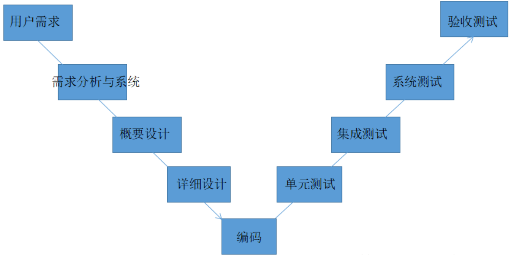
    - W 模型 
- 快速原型模型 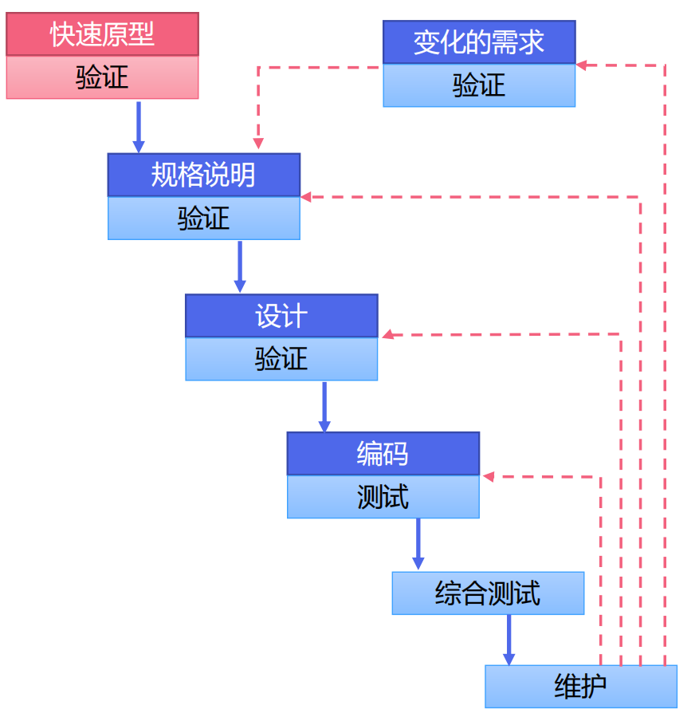
- 增量模型 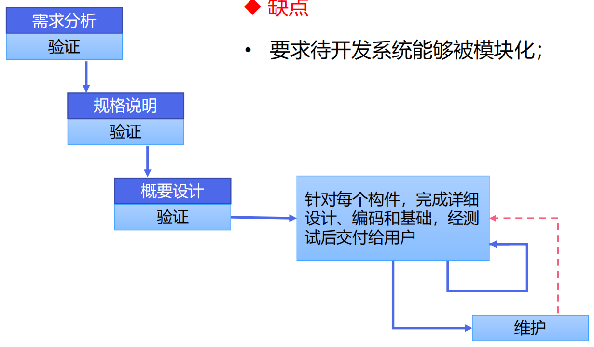
- 螺旋模型，强调**风险分析** 
- 喷泉模型，面向对象模型，联想一下瀑布模型，刚好相反 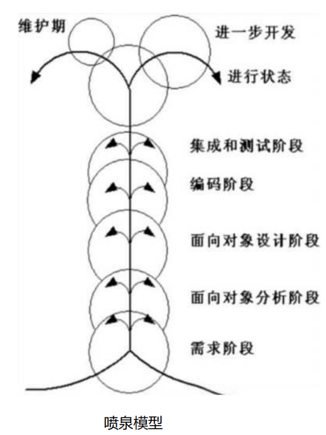
- Rational 统一过程，面向对象模型
- 敏捷过程与极限编程
- 微软过程
- `PSP/TSP`

## 可行性研究

- 回答：**所有定义的问题都有解决办法吗？**
- 目的：最小代价、最短时间确定问题是否有解、值得解
- 三行：技术可行性、经济可行性、操作可行性、法律可行性
- 系统流程图

- 数据流图

- 数据字典：对数据流图中包含的所有元素的定义的**集合**。定义 4 类元素：数据流、数据元素、数据存储、处理
> **数据字典定义实例**
>
> 数据元素编号：DC001
>
> 数据元素名称：考试成绩
> 
> 别名：成绩、分数
>
> 简述：学生考试成绩，分五个等级
>
> 类型长度：两个字节，字符类型
>
> 取值/含义：优 [90-100]，良 [80-89]，中 [70-79]，及格 [60-69]，不及格 [0-59]
> 有关数据项或结构：学生成绩档案
>
> 有关处理逻辑：计算成绩
- 成本/效益分析
> 成本估计：代码行技术（软件成本 = 每行代码的平均成本 × 估计的源代码总行数）、任务分解技术、自动估计成本技术
>
> 成本估计的经验模型：1978年 `Putnam` 提出的，一种动态多变量模型。 $L=C_k\cdot K^{1/3} \cdot t_d^{4/3}$
>
> 成本估计模型：`COCOMO` 模型（基本 `COCOMO` 模型、中级 `COCOMO` 模型、详细 `COCOMO` 模型）），这模型是精确的、定量的好模型。在这里项目的开发类型分为 3 种：组织型、嵌入型、半独立型。

## 需求分析

- 目的：准确回答**系统必须做什么**
- 输出：经过审查的《软件需求规格说明书》
- 数据模型（E-R 图）&rArr; 功能模型（数据流图）&rArr; 行为模型（状态图）
- 需求分析的任务：
    - 确定综合要求：功能需求、性能需求、可靠性和可用性需求、出错处理需求、接口需求、约束、逆向需求、将来可能提出的要求
    - 分析数据要求：建立数据模型如数据字典
    - 导出逻辑模型：状态转换图、数据流图、实体关系图、数据字典、数据处理算法
    - 修正开发计划：深度了解用户需求，找出目前设计的不足
- 分析建模与规格说明
    - 分析建模：数据模型（E-R 图）&rArr; 功能模型（数据流图）&rArr; 行为模型（状态图）
    - 软件需求规格说明：自然语言
- 数据规范化 选第三范式就行
- 状态转换图
    - 包含**事件、状态、行为**
    - 例子：
    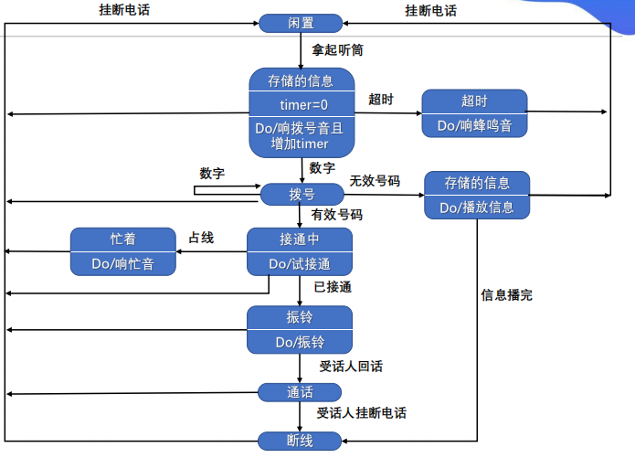
- 其他图形工具 层次方框图、Warnier 图、IPO 图
- 验证软件需求
    - 一致性
    - 完整性
    - 现实性
    - 有效性

## 概要设计

#### 目的 

决定**怎样做**

#### 任务

- 划分组成系统的物理元素
- 设计软件结构

#### 必要性

可以站在全局高度上，花较小的成本，从较抽象的层次上分析对比多种可能的系统实现方案和软件结构，从中选择出最佳的方案和最合理的软件结构，从而用较低的软件成本开发出高质量的软件系统。

#### 设计过程

- 系统设计阶段
- 结构设计阶段

#### 设计原理

- 模块化
- 抽象
- 逐步求精
- 信息隐藏和局部化
- 模块独立 
    - 耦合 无直接耦合、数据耦合、标记耦合、控制耦合、外部耦合、公共耦合、内容耦合
    - 内聚 偶然性内聚、逻辑性内聚、时间内聚、过程内聚、通信内聚、顺序内聚、功能性内聚

#### 启发规则

- 改进软件结构提高模块独立性
- 模块规模应该适中
- 深度、宽度、扇出、扇入应适当
    - 深度 软件结构中控制的层数
    - 宽度 软件结构内同一个层次上的模块总数的最大值
    - 扇出 一个模块直接控制的模块数目
    - 扇入 一个模块被多少个上级模块直接调用的数目
- 模块的**作用域应在控制域之内**，怎样修改才能做到这点
    - 把判定点上移
    - 把在作用域内但不在控制域内的模块移动到控制域内
- 力争降低模块接口的复杂度
- 设计单入口单出口的模块
- 模块功能可以预测
#### 描绘软件结构的图形工具
  - 层次图和 `HIPO` 图：
  - 结构图：
#### 面向数据流的设计方法
- 概念
    - **变换流** 信息沿输入通路进入系统，由外部形式变换为内部形式，经过处理后输出到输出通路
    - **事务流** 数据是**以事务为中心的**，数据沿输入通路到达一个处理 $T$，这个处理根据输入数据的类型在若干个动作序列中选出一个来执行
    - 设计过程 
- 变换分析 是一系列设计步骤的总称，经过这些步骤把具有变换流特点的**数据流图**按预先确定的模式映射成软件结构
- 事务分析 数据流具有明显的**事务特点**（指有一个明显的事务中心，如 ATM 机）时采用事务分析方法。该方法和变换分析的主要差别是**数据流图到软件结构的映射方法不同**。
- 设计优化
    - 在不考虑时间因素的前提下开发并精化软件
    - 在详细设计阶段选出最耗费时间的模块，仔细地设计它们的算法
    - 使用高级程序设计语言编写程序
    - 孤立出大量占用机器资源的模块
    - 必要时重写占用大量机器资源的模块

## 软件体系结构设计

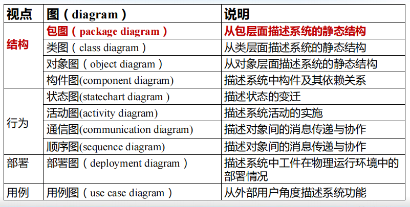

#### 概念
从高层抽象的角度刻画组成软件系统的设计元素及它们之间的逻辑关联

#### 设计元素
- 构件：构成体系结构的基本功能件 
    - 特点
        - 可分离
        - 可替换
        - 可配置
        - 可复用
    - 构件的 UML 表示：
- 连接件：组件之间的连接和交互关系
- 约束：组件中的元素应满足的条件

#### 软件体系结构的不同视图
- 逻辑视图
    - 包图：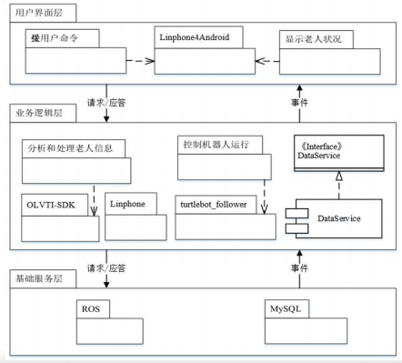
    - 构件图：
- 运行视图
    - 活动图
    - 对象图
- 开发视图
- 物理视图
    - 部署图：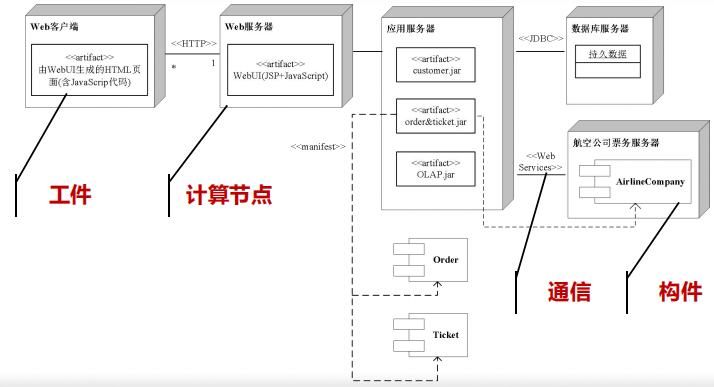

#### 软件设计模式
- 体系结构风格
    - 分层风格：将软件系统按照抽象级别逐次递增或递减的顺序，组织为若干层次，每层由一些抽象级别相同构件组成
    - 管道与过滤器风格：将软件功能实现为一系列处理步骤，每个步骤封装在一个过滤器构件中，相邻过滤器间以管道连接
    - 黑板风格：将软件系统划分为黑板（保存中间数据）、知识源（求解）和控制器（安排知识源活动）三类构件
    - MVC 风格
    - SOA 风格：将软件系统的软构件抽象为一个个的服务（Service），每个服务封装了特定的功能并提供了对外可访问的接口
    - 消息总线风格：包含了一组软构件和一条称为“消息总线”的连接件来连接各个软构件
- 构件设计模式
- 实现设计模式

## 详细设计

#### 目的

回答**具体该如何设计软件**。它不是具体地编写程序，而是设计程序的**蓝图**。

#### 程序结构设计

- 概念 一种设计程序的技术，采用**自顶向下、逐步求精**的设计方法，和**单入口、单出口**的控制接口。
- 控制结构
    - **函数结点** 结点有一个入口线和一个出口线
    - **谓词结点** 结点有**一**个入口线和**两**个出口线，而且它**不改变**程序的数据项的值
    - **汇点** 结点有多个（$\geq 2$）入口线和一个出口线，而且它不执行任何运算
- 正规程序
    - **定义** 具有一个入口线、一个出口线。且对于每个结点，都有一条从入口线到出口线的通路通过该结点
- 正规子程序
    - **定义** 一个正规程序的某个部分仍然是正规程序，那么称它为该正规程序的正规子程序
- 基本程序
    - 定义 如果存在**封闭结构**，封闭结构都是正规程序，且不包括多于一个结点的正规子程序（即它是一种不可再分解的正规程序）
    - 两个结点之间所有**没有重复结点**的通路组成的结构称为**封闭结构**：
    - 三种基本控制结构（顺序结构、选择结构、循环结构）和两个扩充控制结构（多分支结构、UNTIL循环结构）都是基本程序
    - 用以构造程序的基本程序的集合称为**基集合**
    - 如果一个基本程序的函数结点用另一个基本函数程序替换，产生的新的正规程序称为**复合程序**
    - 由基本程序的一个固定的基集合构造出的复合程序，称为**结构化程序**
    - **结构化定理** 任一正规程序都可以函数等价于一个由基集合{顺序，If-else-then，While-do}产生的结构化程序
    - 结构化步骤 给函数结点和谓词结点**编号** &rarr; 函数结点**加出口赋值块** &rarr; 谓词结点**加出口赋值块并汇合** &rarr; 构造循环体：
    - **总结** 看了半天终于懂了这 SB PPT 在讲啥，其实很简单：把所有的函数结点和谓词结点编号，这些结点（包括函数和谓词）下一步去哪个结点也记一下，搞一个 SB 变量 L（代表第 $i$ 个结点），暴力弄一堆判断判断 L = 1/2/3/4/5……，最 SB 的来了，每个 L 下面都挂一个结点，出口拉回去就行。如图：

#### 人机界面设计
- 必须考虑的四个问题：
    - 系统响应时间 指从用户完成某个动作（按回车键或点击鼠标），到系统给出响应之间的时间间隔
    - 用户帮助设施
    - 出错信息处理
    - 命令交互

#### 过程设计工具

- 程序流程图（Flowchart）

- 盒图（N-S）

- PAD 图

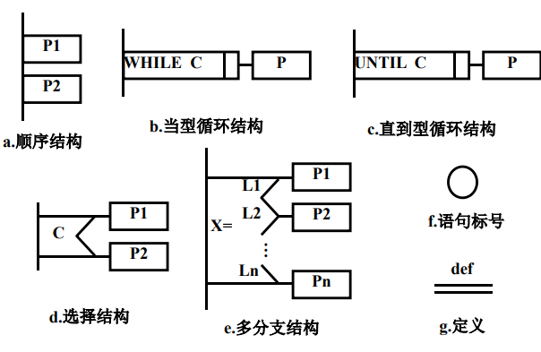

- 判定表

- 判断树

- 过程设计语言（Procedure Design Languag）

#### 面向数据结构的设计方法

- Jackson 图

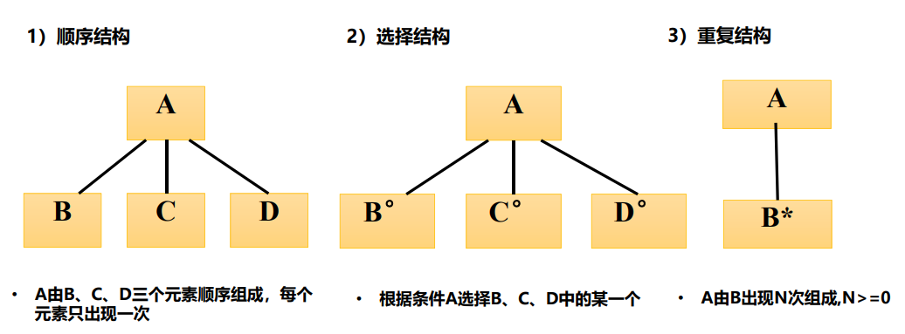

- 改进的 Jackson 图

- Jackson 方法
    - 目标 得出对程序处理过程的详细描述
    - 步骤
        - tmd 有点麻烦啊，做题遇到了再来完善，感觉不考
#### 程序复杂程度的定量度量
- McCabe
    - 流图 “退化”的程序流程图，仅描绘程序的控制流程，不表现对数据的具体操作及循环、选择的条件。
    - 环形复杂度 $V(G)$ = 流图中的区域数；
    - [最准] 环形复杂度 $V(G)$ ＝ 边－点 + 2
    - 环形复杂度 $V(G)$ ＝ 判定结点＋1
    - 实践表明，模块规模以 $V(G)\leq 10$ 为宜。
- Halstead 方法
    - 程序长度 = 程序中运算符出现的总次数 + 操作数出现的总次数
    - 预测程序长度 = $n_1\log_2{n_1}+n_2\log_2{n_2}$，其中 $n_1$ 为的不同运算符（包括关键字）的个数，$n_2$ 为不同操作数（变量和常量）的个数。
    - 预测错误个数 $E = N \log_2{(n1+n2)} / 3000$

## 软件实现
- 编码：把软件设计结果翻译成程序
- 测试：检测程序并改正错误的过程
- 编码和测试统称为**实现**

#### 编码

- 选择程序设计语言
- 编码风格
    - 文档
    - 数据说明
    - 语句构造
    - 输入/输出
    - 效率
        - 程序运行时间
        - 存储器效率
        - 输入/输出效率

#### 软件测试基础

- 软件测试的目标
    - 测试是为了发现程序中的错误
    - 好的测试是极可能发现迄今为止尚未发现的错误
    - 成功的测试是发现了至今为止尚未发现的错误
- 测试的定义：为了发现程序中的错误而执行程序的过程
- 软件测试准则
    - 所有测试都应该能追溯到用户需求
    - 应该远在测试前就制定出测试计划
    - 把 Pareto 原理应用到软件测试中
    - 应该从“小规模”测试开始，并逐步进行“大规模”测试
    - 穷举测试是不可能的；因此，测试只能证明程序中有错误，不能证明程序中没有错误
    - 为了达到最佳测试效果，应该由独立的第三方从事测试工作
- 测试方法
    - 黑盒测试（也称功能测试） 如果已经知道软件应该具有的功能，可以通过测试来检验每个功能是否都能正常使用
    - 白盒测试（也称结构测试） 如果知道软件内部工作过程，可以通过测试来检验软件内部动作是否按照规格说明书的规定正常进行
- 软件测试的步骤
    - 模块测试 模块测试又称单元测试，它把每个模块作为单独的实体来测试
    - 子系统测试 子系统测试是把经过单元测试的模块放在一起形成一个子系统来测试
    - 系统测试 系统测试是把经过测试的子系统装配成一个完整的系统来测试
    - 验收测试 验收测试把软件系统作为单一的实体进行测试（利用用户的实际数据测试）
    - 平行运行 平行运行是同时运行新开发出来的系统和将被它取代的旧系统，以便比较新旧两个系统的处理结果
- 测试阶段的信息流

- 软件测试的步骤
    - 单元测试
        - 集中对源代码实现的每个程序单元进行测试，检查各个程序模块是否正确地实现了程序规定的功能。（往往采用白盒测试技术）
        - 过程
            - 测试重点
            - 代码审查
            - 计算机测试
                - 驱动程序：相当于“主程序”，用来把测试数据传送给被测试的模块，并打印有关结果
                - 存根程序：用来代替被测试模块所调用的模块，相当于“虚拟子程序”
    - 集成测试
        - 把已经测试过的程序模块组装起来，进行集成测试，主要对设计相关的软件体系结构的构造进行测试
        - 种类
            - 非渐增式测试方法：先对每个模块独立地进行测试，然后再将所有模块集成在一起进行全面测试
            - 渐增式测试方法
                - **自顶向下**集成，需要存根程序，不需要驱动程序
                    - 深度优先策略
                    - 宽度优先策略
                - **自底向上**集成，不需要存根程序，需要驱动程序
                - **混合法测试**，结合自顶向下和自底向上的方法，同时进行上下集成测试。
            - **回归测试**，保证由于调试或其他原因引起的程序变化，不会导致额外错误的测试活动
    - 确认测试（有效性测试）
        - 要检查已实现的软件是否满足了软件需求规格说明书中确定的各种需求，以及软件配置是否完全、正确。（往往采用黑盒测试技术，以用户为主）
        - 种类
            - Alpha 测试
            - Beat 测试
    - 系统测试
        - 把已经经过确认的软件纳入到实际运行环境中，与系统中其他成分组合在一起进行测试
- 白盒测试技术
    - 如果知道软件内部工作过程，可以通过测试来检验软件内部动作是否按照规格说明书的规定正常进行
    - 逻辑覆盖
        - 语句覆盖（最弱）：设计足够的测试用例，使得被测试程序中的每条语句至少执行一次
        - 判定覆盖（覆盖判定的所有结果即可，通常是让表达式的值是 `True` 和 `False` ）：设计足够的测试用例，使得被测试程序中的每个判定至少获得一次真值和假值，从而使程序中每一个分支至少通过一次
        - 条件覆盖（保证每一个变量都被 `toggle` 过，通常是让所有的变量的值是 `True` 和 `False` ）：设计足够的测试用例，使得每个判定表达式中的每个条件的值至少出现一次
        - 判定/条件覆盖（判定覆盖和条件覆盖的组合）
        - 条件组合覆盖（$2^n$）
    - 结构覆盖
        - 点覆盖
        - 边覆盖
        - 路径覆盖（所有路径走一遍，注意和判定覆盖的区别）
    - 控制结构测试
- 黑盒测试技术
    - 定义：测试对象看做一个黑盒子，测试人员完全不考虑程序内部的逻辑结构和内部特性，只依据程序的需求规格说明书，检查程序的功能是否符合它的功能说明，又叫做*功能测试*或*数据驱动测试*。    
    - 等价划分
        - 如果将所有可能的输入数据（有效的和无效的）划分为若干个等价类，就可以假定用每一个等价类中的代表值作为测试用例来进行测试时，等价于用该类中所有值进行了测试
        - 如果某输入条件规定了输入的范围，那么可以划分为一个有效的等价类和两个无效的等价类。
        - 如果规定了输入数据的个数，则类似地也可以划分出一个有效等价类和两个无效等价类。
        - 如果输入条件规定了输入值的集合，或者规定了“必须如何”的条件，这时可确立一个有效等价类和一个无效等价类。
        - 如果规定了输入数据为整型，则可以划分出正整数、负整数、零3个有效等价类。
        - 如果输入条件是一个布尔量，则可以确定一个有效等价类和一个无效等价类。
        - 如果程序的处理对象是表格，则可以应该使用空表，以及含一项或多项的表。
        - 如果某个输入条件规定了一组可能的值，且程序可以对不同的值作出不同的处理，那么可以为每种值确定一个有效的等价类，同时还有一个无效等价类
        - 如果规定了输入数据必须遵守的规则，则可以确立一个有效等价类（符合规则）和若干个无效等价类（从不同角度违反规则）。
    - 边界值分析
    - 错误推测：错误推测法在很大程度上靠直觉和经验进行。列举出程序中可能的错误和容易发生错误的特殊情况，且根据它们选择测试方案。进一步测试时要着重测试哪些发现了较多错误的组合情况。
    - 实用测试策略
        - 任何情况下都进行边界值分析
        - 必要时用等价划分法补充测试方案
        - 必要时再用错误推测法补充测试方案
- 调试
    - 调试过程 调试是在测试发现错误之后排除错误的过程
    - 调试途径 
        - 蛮干法 打印内存内容，寻找错误，效率最低
        - 回溯法 从出问题的程序段人工回溯，直到找到错误
        - 原因排除法
            - 对分查找
            - 归纳
            - 演绎
- 软件可靠性
    - 对于故障可修复系统，应同时用可靠性、可用性：
        - 可靠性 程序在给定**时间间隔内**，按照规格说明书的规定成功地运行的概率
        - 可用性 程序在给定**时间点**，按照规格说明书的规定成功地运行的概率
    - 稳态可用性：$A_{ss}=\frac{T_{up}}{T_{up}+T_{down}}$
    - 估计故障总数的方法
        - 植入故障法（很像生物中的*标志重捕法*）：$\hat{N}=\frac{n}{n_s}N_s$
        - 分别测试法：$\hat{B}_0=\frac{B_2}{b_c}B_1$

## 软件维护
#### 软件维护开始前的阶段：软件交付
- 软件交付：新系统和旧系统的替换
- 软件交付的方式
    - 直接方式
    - 并行方式
    - 逐步方式
#### 软件维护的定义
- 定义：在软件已经交付之后，为了改正错误或满足新的需要而修改软件的过程
- 维护类型
    - 改正性维护：交付给用户的软件，即使通过严格的测试，仍可能存在一些潜在的错误在用户使用的过程中发现和修改。（如*操作系统安装补丁*）
    - 适应性维护：新的硬件系统和外部设备时常更新和升级，一些数据库环境、数据输入/输出方式、数据存储介质等也可能发生变换。为了适应这些环境变化而修改软件的过程叫做适应性维护
    - 完善性维护（大部分）：软件投入使用过程中，用户可能还会有新的功能和性能要求，可能会提出增加新功能、修改现有功能等要求。
    - 预防性维护（最少见）：为了改进软件未来的可维护性或可靠性，或者给未来的改进奠定更好的基础而进行的修改。
        - 把今天的方法学应用到昨天的系统上，以支持明天的需求
        - 预防性维护的理由
            - 对于旧系统而言，维护一行原代码的代价可能是最初开该行源代码代价的14－40倍；重新设计软件体系结构（程序和数据结构）使用最新的设计理念，对将来的维护有较大帮助；有旧系统可作为软件原型使用，能提高开发效率；用户具有较多使用该软件的经验，因此，能够很容易地搞清新的变更需求和变更的范围。5）利用逆向工程和再工程的工具，可以使一部分工作自动化。6）在完成预防性维护的过程中可以建立起完整的软件配置。
#### 软件维护的特点
- 非结构化维护：软件配置唯一成分是代码，维护从评价程序代码开。不能进行回归测试，维护代价巨大
- 结构化维护：有完整的软件配置，维护从评价设计文档开始，先修改设计、接着修改代码，再进行回归测试
- 软件维护代价
    - 有形代价：软件维护的费用开支
    - 无形代价：可用的资源必须供维护任务使用，以致耽误甚至丧失了开发的良机
- 维护工作量模型：$M=P+KXe^{(c-d)}$
    - M: 用于维护工作的总工作量：
    - P: 生产性工作量；
    - K: 经验常数；
    - c: 因缺乏好的设计和文档而导致软件复杂性的度量：
    - d: 维护人员对软件熟悉程度的度量。

#### 软件维护过程

提出维护要求、分析维护要求、提出维护方案、审批维护方案、确定维护计划、修改软件设计、修改程序代码、测试程序、复查验收

#### 软件的可靠性维护

- 软件的可维护性：维护人员理解、改正和改进软件的难易程度
- 决定可维护性的 5 个主要因素
    - 可理解性
    - 可测试性
    - 可修改性
    - 可移植性
    - 可重用性
- 文档 
    - 用户文档
    - 系统文档
- 可维护性复审，也即配置复审        
- 影响维护工作量的因素
    - 系统大小
    - 程序设计语言
    - 系统年龄
    - 先进的软件开发技术
#### 软件工程再过程
- 库存目录分析
- 文档重构
- 逆向工程
- 代码重构
- 数据重构
- 正向工程

## 面向对象方法学引论
#### 概念
- 对象：问题域中某个实体的抽象。由描述该对象属性的数据、及对这些数据施加的所有操作封装在一起构成的统一体
- 对象中的数据表示对象的状态，一个对象的状态只能由该对象的操作来改变
- 类：对具有相同数据、相同操作的一组相似对象定义
- 实例：某个特定类描述的一个具体的对象
- 消息：请求对象执行处理或回答信息的要求（既可以是数据流，也可以是控制流），由以下三个部分构成
    - 接受消息的对象
    - 消息名（信息选择符）
    - 参数（零个或多个变元）
- 方法
- 属性
- 封装
- 继承
- 多态
- 重载
    - 函数重载
    - 运算符重载
- 面向对象方法学四要素：对象、类、继承、消息（通信）

#### 面向对象建模
- 对象模型
    - 描述系统的数据结构，静态的、结构化的系统的数据性质
    - `UML` 中的类图
        - 类名
        - 属性
        - 方法（服务、操作）
        - 关联
            - 普通关联
            - 角色关联
            - 限定关联
            - 类关联
        - 聚集
            - 共享聚集
            - 组合聚集
        - 泛化（继承）
            - 普通泛化
            - 受限泛化
        - 依赖
        - 细化
        - 图符 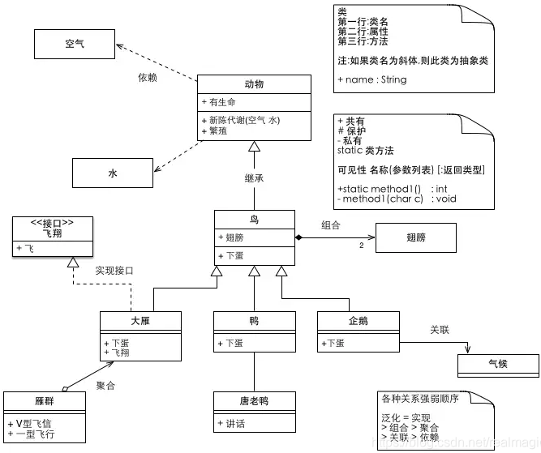
- 动态模型
    - 描述系统的控制结构，表示瞬时的、行为化的系统的控制性质，规定了对象模型中的对象合法变化序列
    - `UML` 中的状态图
    - 也可以有序列图、活动图
    - 包含事件、状态、行为       
- 功能模型
    - 描述系统的功能
    - `UML` 中的用例图，描述的是外部行为者所理解的系统功能
    - 泛化
    - 包括

## 面向对象分析
#### 什么是面向对象分析
需求建模 = 需求分析 + 模型建立

#### 三个模型
- 对象模型
- 动态模型
- 功能模型

#### 五个层次
- 主题层
- 类与对象层
- 结构层
- 属性层
- 服务（指的就是操作、方法）层

#### 需求分析内容
- 问题范围
- 功能需求
- 性能需求
- 应用环境
- 假设条件

#### 建立对象模型
- 确定类和对象
    - 用自然语言书写需求陈述，把陈述中的**名词**作为类与对象的候选者，从**形容词**中考虑属性，把**动词**作为服务（操作）的候选者。
- 确定关联
    - 动词提取关联
    - 需求陈述中隐含的关联
    - 问题域知识得出的关联
- 划分主题
- 确定属性
- 识别继承（泛化）关系

#### 建立动态模型
- 序列图（事件跟踪图）：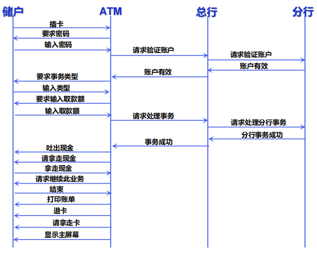
- 活动图：
- 状态图：
- 步骤
    - 编写脚本
    - 设想用户界面
    - 画事件跟踪图（序列图）
    - 画状态图
    - 审查

#### 建立功能模型
- 步骤
    - 画系统模型图（其实就是零级数据流图）
    - 画功能级数据流图（其实就是一级或者二级数据流图）
    - 描述处理框功能

#### 定义服务
就是定义操作、方法

## 面向对象设计
#### 面向对象设计准则
- 模块化
- 抽象
- 信息隐蔽
- 弱耦合
- 强内聚
- 可重用

#### 启发规则
- 设计结果应该清晰易懂
- 特殊结构的深度应适当
- 设计简单的类
- 使用简单的协议
- 使用简单的服务
- 把设计变动减至最小

#### 软件重用
- 重用的三个层次
    - 知识重用
    - 方法、标准重用
    - 软件成分重用
- 重用级别
    - 代码重用
    - 设计结果重用
    - 分析结果重用
- 典型可重用软件成分
    - 项目计划
    - 成本计划
    - 体系结构
    - 需求模型和规格说明
    - 设计
    - 源代码
    - 用户文档和技术文档
    - 用户界面
    - 数据
    - 测试用例
- 类构件重用
    - 实例重用
    - 继承重用
    - 多态重用
- 软件重用的效益
    - 质量
    - 生产率
    - 成本

## 面向对象实现
#### 程序设计语言
- 面向对象设计结果可以用面向对象语言、也可以用非面向对象语言实现
- 选择程序设计语言的因素：软件的应用领域、软件问题的复杂性、软件的工作环境、软件的性能需求、开发人员的知识水平
- 特点
    - 支持类与对象
    - 实现整体-部分结构
    - 实现一般-特殊（泛化）结构
    - 实现属性和服务机制
    - 类型检查
    - 类库
    - 效率
    - 持久保存对象
    - 参数化类
    - 开发环境
#### 程序设计风格
- 提高可重用性
- 提高可扩充性
- 提高健壮性
#### 测试策略
- 单元测试
- 集成测试
    - 基于线程的测试，把响应系统的一个输入所需要的类继承起来测试
    - 基于使用的测试，先测试独立类，再测试使用独立类的下一层次的类，重复至完毕
- 确认测试
    - 不考虑细节，专注于检查用户可见的动作和用户可识别的输出
#### 设计测试用例
- 测试类的方法
    - 随机测试
    - 划分测试
        - 基于状态的划分
        - 基于属性的划分
        - 基于功能的划分
    - 基于故障的测试

## 软件项目管理
#### 估算软件规模
- 代码行技术：$LOC=\frac{\overline{a}+4\overline{m}+\overline{b}}{6}$，其中 $\overline{a}$ 是最小规模、$\overline{m}$ 是最有可能规模、$\overline{b}$ 是最大规模
- 功能点技术
    - 信息域特性
        - 输入项数
        - 输出项数
        - 查询数
        - 主文件数
        - 外部接口数
    - 估算功能点的步骤
        - 计算未调整的功能点数
        - 计算技术复杂性因子
        - 计算功能点数

#### 工作量估算
- 工作量是软件规模的函数，单位是 $pm$，人月
- 静态单变量模型
    - 面向 KLOGD 估算模型
    - 面向 FP 估算模型2
- 动态多变量模型：$E=\quad(LOC\times B^{0.333}/P)^{3}\times(1/t)^{4}$
- COCOMO2 模型（构造性成本模型，constructive cost model）
    - 应用系统组成模型
    - 早期设计模型
    - 后体系结构模型

#### 进度计划
- 估计开发时间
    - Walston Felix 模型
    - 原始 COCOMO 模型
    - COCOMO2 模型
    - Putnam 模型
- Gantt 图：
- 工程网络：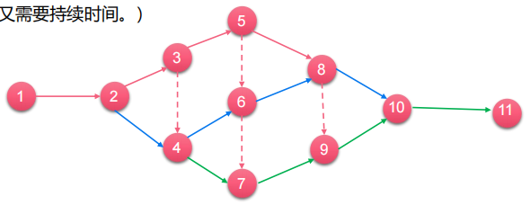
- 估算工程进度
- 关键路径
- 动机时间

#### 人员组织
- 民主制程序员组
- 主程序员组
- 现代程序员组

#### 质量保证
- 包括软件质量要素、软件评价准则、软件质量度量的三个层次的 McCall 软件质量度量模型
- 软件质量保证措施
    - 基于非执行的测试
    - 基于执行的测试
    - 程序正确性证明
    
#### 软件配置管理
- 概念：是在软件的**整个**生命周期内管理变化的一组活动，具体包括：
    - 标识变化
    - 控制变化
    - 确保适当地实现了变化
    - 向需要知道这类信息的人报告变化
- 软件配置
    - 软件配置项
    - 基线
        - 确定前，可以迅速、非正式地修改；确定后，仍然可以修改，但必须应用特定的、正式的过程来评估、实现和验证每个变化
- 软件配置管理的五个任务
    - 标识
        - 基本对象
        - 聚集对象：基本对象和其他聚集对象的集合
    - 版本控制
    - 变化控制
    - 配置审计
    - 状态报告

#### 能力成熟度模型（Capability Maturity Model，CMM）
- 初始级
- 可重复级
- 已定义级
- 已管理级
- 优化级

## 名词八股
|名词|解释|
|----|----|
|软件工程|软件工程是将**系统的、规范的、可量化**的方法应用于**软件开发、运行和维护**的过程，以及上述方法的研究|
|耦合|对模块间接口的复杂程度（即进入或访问模块某点的复杂程度、通过接口的数据的复杂程度）的度量|
|内聚|模块内各个元素彼此结合的紧密程度，是信息隐藏和局部化概念的自然扩展|
|黑盒测试|也称*功能测试*，测试对象看做一个黑盒子，测试人员完全不考虑程序内部的逻辑结构和内部特性，只依据程序的需求规格说明书，检查程序的功能是否符合它的功能说明|
|白盒测试|也称*结构测试* ，如果知道软件内部工作过程，可以通过测试来检验软件内部动作是否按照规格说明书的规定正常进行|
|测试用例|是为某个特殊目标而编制的一组测试输入、执行条件以及预期结果，以便测试某个程序路径或核实是否满足某个特定要求|
|变换流|信息沿输入通路进入系统，由外部形式变换为内部形式，经过处理后输出到输出通路|
|事务流|数据是以事务为中心的，数据沿输入通路到达一个处理 $T$，这个处理根据输入数据的类型在若干个动作序列中选出一个来执行|
|单元测试|集中对源代码实现的每个程序单元进行测试，检查各个程序模块是否正确地实现了程序规定的功能。（往往采用白盒测试技术）|
|集成测试|把已经测试过的程序模块组装起来，进行集成测试，主要对设计相关的软件体系结构的构造进行测试|
|确认测试（有效性测试）|要检查已实现的软件是否满足了软件需求规格说明书中确定的各种需求，以及软件配置是否完全、正确|
|系统测试|把已经经过确认的软件纳入到实际运行环境中，与系统中其他成分组合在一起进行测试|
|软件维护|在软件已经交付之后，为了改正错误或满足新的需要而修改软件的过程|
|独立路径|程序控制流图（CFG）中包含至少一条新节点或边的路径，是不能通过其他已有路径的组合构造出来的路径|
|对象|问题域中某个实体的抽象。由描述该对象属性的数据、及对这些数据施加的所有操作封装在一起构成的统一体|
|作用域|受该模块内的判定影响的所有模块的集合|
|控制域|该模块及其下级模块的集合|
|面向对象|以**对象为核心**的软件开发方法学，它将系统中的实体抽象为对象，通过对象的**属性（数据）和方法（行为）**来描述其特性和功能。面向对象的核心思想是通过**封装、继承、多态**等机制来实现模块化、复用性和灵活性|
|需求分析|系统性地**收集、分析、定义和验证**用户对软件系统的**功能需求**和**非功能需求**的过程|
|非结构化维护|软件配置唯一成分是代码，维护从评价程序代码开。不能进行回归测试，维护代价巨大|
|结构化维护|有完整的软件配置，维护从评价设计文档开始，先修改设计、接着修改代码，再进行回归测试|
|逆向工程|软件工程师基于低抽象层次的软件制品，借助软件工程方法和技术，产生高抽象层次的软件制品|

## 英文缩写对照
|缩写|解释|
|----|----|
|SCM|Software Configuration Management，软件配置项管理|
|McCall|软件质量度量模型|
|McCabe|软件复杂性度量模型，也就是常算的环形复杂度|
|COCOMO|构造性成本模型，就是成本估算|

## 概念八股（均选自雨课堂）

#### 第一、二章

1. **“软件就是程序，软件开发就是编程序” 这种观点是否正确？为什么？** 不正确。软件是由程序、数据、文档组成的一类系统，它可以在计算机系统的支持下实现特定的功能，并提供相关服务。
1. **什么是软件工程？软件工程要解决的核心问题是什么？** 软件工程是将系统的、规范的、可量化的方法应用于软件开发、运行和维护的过程，以及上述方法的研究。要解决的核心问题是软件危机。
1. **什么是软件危机？它有哪些典型表现？为什么会出现软件危机？** 软件开发和维护中遇到的困难和问题称为软件危机。典型表现有软件开发成本高且经常超支、软件无法按时交付且经常延期、交付的软件存在质量问题。出现软件危机的原因有：软件本身特点造成、软件开发与维护的方法不正确、软件开发方式和工具落后。
1. **何为计算机辅助软件工程？举几个使用过的Case工具和环境** 指借助计算机软件来辅助软件开发、运行、维护和管理的过程。Case 工具：SonarQube、Junit、Microsoft Office、Visual Studio、Eclipse、Visual Studio Code、编程语言的各种编译器、Docker、Git、GitLab、Android Studio、Copilot。
1. **软件工程师应具备哪些方面的知识、能力和素质？** 需要掌握软件架构、运行平台、软件设计与建模、设计质量保证等方面的知识，具备开展软件设计的多方面能力和素质，包括团队合作、交流沟通、写作表达、权衡折中。

#### 第三、四章
1. **简述瀑布模型、快速原型模型、增量模型、迭代模型、螺旋模型、基于构件的过程模型、统一过程模型等过程模型的优缺点及适用场景**
    1. 瀑布模型。优点是有利于大型软件开发过程中的组织、管理，有利于软件开发方法、工具的研究，进而提高开发质量和效率；缺点是模型要求客户清楚地给出所有需求（实际上不可能）、实际开发难严格按照模型进行、客户在最后才能看到软件开发的情况、开发过程逆转代价大
    1. 原型模型。优点是快速构建易修改、容易适应新的需求变化、用户参与、处理模糊需求；缺点是快速构建的功能弱、人员资源规划管理难、对开发环境要求高
    1. 增量模型。优点是人员资源规划管理灵活、可观测已开发的模块受欢迎程度、可发布部分功能给客户；缺点是不能集成的风险、容易退化为边做边改模型导致失去整体性
    1. 迭代模型。小步快跑。优点是可以逐步细化地获取用户需求；缺点是迭代次数难以确定、增大软件开发复杂度。
    1. 螺旋模型。可把它看作在每个阶段之前都增加风险分析的快速原型模型。优点是设计灵活、成本计算简单。缺点是需要人员经验丰富，不能及时标识风险会造成重大损失
    1. 基于构件的过程模型。以软件重用为指导思想，优点是能极大提高效率，好像没有缺点。
    1. 喷泉模型。优点是各个阶段无界限可同步开发、提高开发效率；缺点是需要大量人员、不利于项目管理、要求严格管理文档、加大审核难度
    1. 统一过程模型。优点建立在优秀理念上、对开发过程的直观管理；缺点是没有包含维护阶段、无法实现大范围重用、人员管理和测试上有缺陷
1. **敏捷软件开发的特点是什么？简述其开发的原则？敏捷方法适合哪些类别应用的软件开发？**
    1. 对变化和不确定性地更快速、更敏捷的反应特性。
    1. 原则：计划游戏、隐喻、小型发布、简单设计、测试驱动开发、重构、结对编程、集体拥有代码、持续集成、每周 40 小时工作制、现场用户、编码标准
    1. 适合：需求不明确或者易变的项目
1. **UML 可从哪些视点，提供了哪些图来描述和分析软件需求？**
    1. 静态视图：类图、对象图
    1. 动态视图：序列图、用例图
    1. 实现视图：组件图、部署图
    1. 模型管理视图：包图
1. **请分别指出获得软件需求和分析软件需求的步骤**
    1. 获得软件需求：明确问题和解决方案、导出构思软件需求、描述初步软件需求、评审确认需求
1. **简述程序设计语言的选择需要考虑的因素和编写代码的原则**
    1. 因素：软件的应用领域、与遗留系统的交互、软件的特殊功能及需求、软件的目标平台、程序员的编程经验
    1. 原则：易读、易改、降低代码复杂度、重用、容错、与文档一致

#### 第十一、十二、十三章
1. **简述软件实现的过程和原则** 
    1. 过程：编写代码、单元测试、程序调试、软件测试
    1. 原则：基于设计编码、质量保证贯彻全过程、

## 做试卷遇到的
1. 一个设计好的软件结构，通常顶层扇出比较高，中层扇出比较少，底层有高扇入
1. 当项目中有 $n$ 人时，沟通渠道最多有 $\frac{n(n-1)}{2}$ 种
1. 面向对象设计准则在逻辑上的 4 部分：问题域部分、人机交互子系统、任务管理子系统、数据管理子系统
1. 工程专家 $B.~W.~Boehm$ 的 7 条软工原理：
    1. 用分阶段的生命周期计划严格管理
    1. 坚持进行阶段评审
    1. 实行严格的产品控制
    1. 采用现代程序设计技术
    1. 软件工程结果应能清楚审查
    1. 开发小组人员应少而精
    1. 承认不断改进工程实践的必要性
1. 面向对象方法学四要素：对象、类、继承、消息通信
1. 文档是软件产品的一部分，没有文档的软件就不称其为软件
1. 结构化程序的特点：
    1. **模块化**。将程序划分为若干功能单一、相对独立的模块。
    1. **三种基本控制结构**。顺序结构、选择结构、循环结构
    1. **单入口单出口**。每个模块或控制结构都只有一个入口和一个出口。
    1. **自顶向下、逐步求精**。从总体设计入手，将问题逐步分解为更小的子问题。
    1. **避免使用 GOTO 语句**。提高程序的逻辑性和可维护性。
1. 软件危机产生的原因：
    1. 软件本身特点造成。不可见性、复杂性、质量要求高、无损耗等特点造成
    1. 软件开发与维护的方法不正确。忽视软件需求分析、认为软件开发就是写程序并使之运行、轻视软件维护
    1. 软件开发方式、工具落后（与上面一点的区别是，上面一点是主观原因造成的，下面这点是客观原因造成的）
1. 影响维护的因素：可理解性、可测试性、可修改性
1. 结构图的矩形框代表模块
1. 软件的逻辑模型（包括数据流图、数据字典）形成于需求分析阶段
1. 从数据存储流向外部实体不可能发生
1. 数据流图应聚焦于数据流，对某些实体不必要的流向可以省略，不含数据流的动作不该画
1. 判定表、判定树属于数据加工内容
1. 编程语言
    1. 第一代：机器语言
    1. 第二代：汇编语言
    1. 第三代：高级语言（摆脱硬件依赖）
1. 问题定义阶段提出了软件系统的目标、范围与功能说明
1. 数据流图中的外部实体成为数据项
1. 用户要求是指软件系统必须满足的所有性质和限制（Features and Constraints）
1. PET 的主要功能是支持白盒测试，可以监视测试的实际覆盖度
1. `PAD` 图的 `if` 记得要标真假
1. 软件的发展经历了四个阶段（有时候也认为是五个）
1. 软件中包含复杂判定组合时只有判定表和判定树能表达出各种动作对应关系
1. 各种软件维护类型中最重要的是完善性维护
1. 按照软件功能划分软件：系统软件、支撑软件、应用软件
1. 可行性研究的四个方面：经济、技术、法律、操作（经法操技）
1. 用户界面的**可使用性**是用户界面设计的重要目标
1. 三种概要设计方法：结构化设计方法（面向数据流）、Jackson 设计方法（面向数据结构）、面向对象设计方法（面向对象）
1. 软件测试方法由静态分析方法和动态执行方法（运行被测试的程序）
1. 软件工程的发展可分为程序时期、软件=程序+文档、软件产品时期
1. 耦合越弱、模块独立性越强
1. 编码的目的是通过选定的**程序设计语言**，把模块的过程性描述翻译为书写的源程序
1. 源程序的文档化：有意义的变量名、适当的注释、标准的书写格式
1. 原型设计方法对软件设计和开发人员的要求最高
1. 复审发生在软件生命周期的每个阶段结束之前
1. 等价划分测试画两张表：划分等价类表（输入条件、带序号的合理等价类、带序号的不合理等价类）、测试用例表（输入数据、预期结果、覆盖范围）
1. 用例图和数据流图的一个区别是：用例图聚焦于用例，数据流图聚焦于数据流，这造成了：假设有 A 为 B 代理事件 C 时，用例图中是 A 执行用例 C，B 将与该用例无关，B 被忽视；而数据流图中则直接忽视 A，认为 A 与数据的传输没有太大关系，直接将数据流从 B 流向 C
1. 软件不会磨损，但会逻辑老化
1. 快速原型技术适用于软件产品要求大量的用户交互、或产生大量的可视输出、或设计一些复杂的算法的场合
1. 软件成分重用级别：**代码重用、设计结果重用、分析结果重用**
1. RUP 软件过程中生命周期：**初始阶段、细化阶段、构建阶段、交付阶段**
1. 软件配置项的修改**不一定都要**通过正式的变更控制管理
1. 面向对象与面向过程方法学相比有哪些优点、哪些缺点？ 优点：更贴近现实世界、模块化、可重用性、易扩展、并行开发 缺点：学习难、初期开发效率低、性能开销大
1. 文档是软件的一部分，没有文档的软件就不称其为软件
1. 原型法应具备的基本特质是**快速、容易修改**
1. 可行性研究中最难决断、最关键的问题是**技术可行性**
1. `CMM/CMMI` 的五个阶段：**初始级、可重复级、已定义级、已管理级、优化级**
1. **用例叙述**的属性：用例名、用例标识、主要执行者、目标、范围、前置条件、交互动作
1. 问题定义阶段确立了**概念模型**，需求分析阶段确立了**逻辑模型**，设计（概要、详细）阶段确立了**物理模型**
1. 交罚金都是**扩展**关系，当 VIP 都是泛化（继承）关系
1. 软件概要设计关键的一步是确定软件体系结构，它直接影响下一阶段详细设计和编码工作
1. `Prolog` 语言适合逻辑计算，不适合科学计算项目
1. 对于写数据字典的题目，对于其给定的实体，写出以下属性：数据项名称、数据类型、长度、取值范围、描述、备注
1. 数据流图中，圆代表**加工**，注意选择时很容易误选为源/终点
1. 面向对象的五个层次
1. 传统软件方法学中软件设计的基本原理及内容 原理：采用**结构化技术**完成软件开发的各项任务，并使用适当的工具或环境来支持其应用。 内容：把软件生命周期划分为各个阶段，顺序地完成每个阶段的任务。