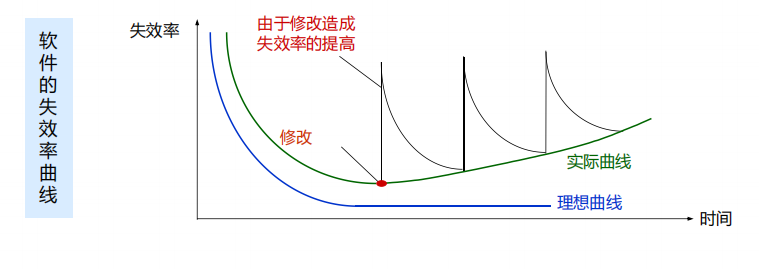

# 软件工程笔记

## 软件工程概论

- 软件的概念：软件 = 程序 + 数据 + 文档
- 软件的分类：系统软件、支撑软件、应用软件
- 软件危机

- 软件工程定义：是指导计算机软件开发和维护的一门工程学科
- 软件工程三要素：方法、工具、过程
- 软件生命周期：软件定义（问题定义、可行性研究、需求分析）、软件开发（总体设计、详细设计、编码和单元测试、综合测试）、运行维护（维护）
- 软件维护分类：预防性维护、改正性维护、适应性维护、完善性维护
- 软件过程：瀑布模型、快速原型模型、增量模型、螺旋模型（强调**风险分析**）、喷泉模型（面向对象，联想一下瀑布模型，刚好相反）、Rational 统一过程（面向对象）、敏捷过程与极限编程、微软过程、`PSP/TSP`

## 可行性研究

- 回答：**所有定义的问题都有解决办法吗？**
- 目的：最小代价、最短时间确定问题是否有解、值得解
- 三行：技术可行性、经济可行性、操作可行性
- 系统流程图

- 数据流图

