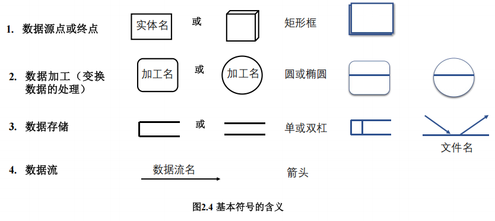
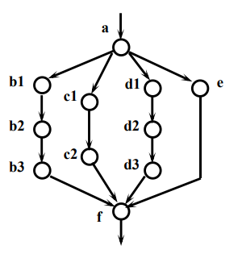
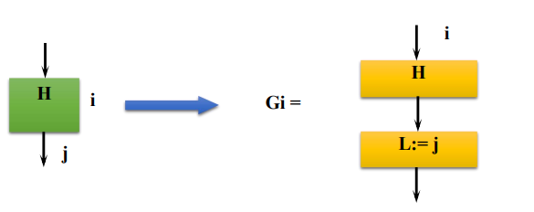
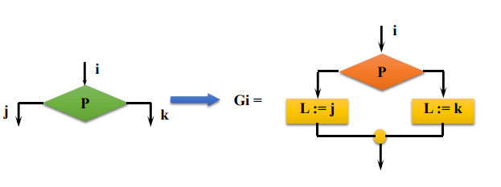
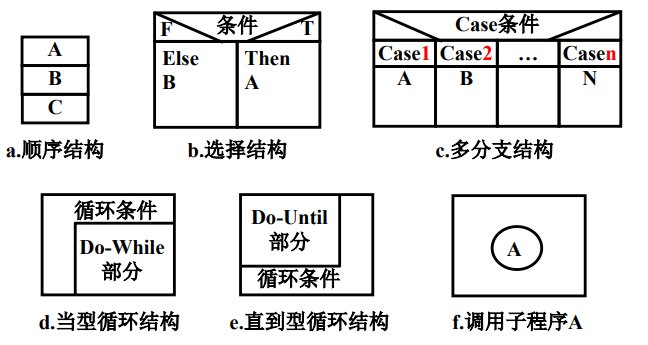
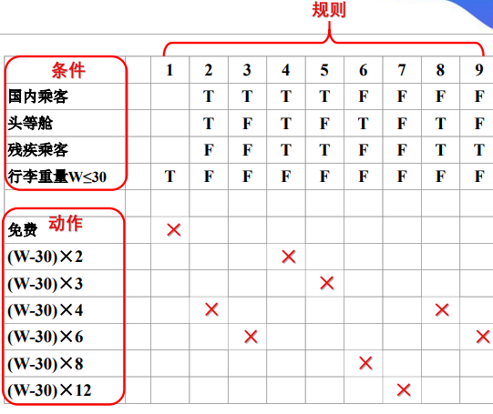

# 软件工程笔记

## 软件工程概论

- 软件的概念：软件 = 程序 + 数据 + 文档
- 软件的分类：系统软件、支撑软件、应用软件
- 软件危机

- **定义** 是指导计算机软件开发和维护的一门工程学科
- **软件工程三要素** 方法、工具、过程
- **软件生命周期** 软件定义（问题定义、可行性研究、需求分析）、软件开发（总体设计、详细设计、编码和单元测试、综合测试）、运行维护（维护）
- **软件维护分类** 预防性维护、改正性维护、适应性维护、完善性维护
- **[重要] 软件过程** 瀑布模型 &rArr; 快速原型模型 &rArr; 增量模型 &rArr; 螺旋模型（强调**风险分析**） &rArr; 喷泉模型（面向对象，联想一下瀑布模型，刚好相反） &rArr; Rational 统一过程（面向对象） &rArr; 敏捷过程与极限编程 &rArr; 微软过程 &rArr; `PSP/TSP`

## 可行性研究

- 回答：**所有定义的问题都有解决办法吗？**
- 目的：最小代价、最短时间确定问题是否有解、值得解
- 三行：技术可行性、经济可行性、操作可行性
- 系统流程图

- 数据流图

- 数据字典：对数据流图中包含的所有元素的定义的**集合**。定义 4 类元素：数据流、数据元素、数据存储、处理
> **数据字典定义实例**
>
> 数据元素编号：DC001
>
> 数据元素名称：考试成绩
> 
> 别名：成绩、分数
>
> 简述：学生考试成绩，分五个等级
>
> 类型长度：两个字节，字符类型
>
> 取值/含义：优 [90-100]，良 [80-89]，中 [70-79]，及格 [60-69]，不及格 [0-59]
> 有关数据项或结构：学生成绩档案
>
> 有关处理逻辑：计算成绩
- 成本/效益分析
> 成本估计：代码行技术（软件成本 = 每行代码的平均成本 × 估计的源代码总行数）、任务分解技术、自动估计成本技术
>
> 成本估计的经验模型：1978年 `Putnam` 提出的，一种动态多变量模型。 $L=C_k\cdot K^{1/3} \cdot t_d^{4/3}$
>
> 成本估计模型：`COCOMO` 模型（基本 `COCOMO` 模型、中级 `COCOMO` 模型、详细 `COCOMO` 模型）），这模型是精确的、定量的好模型。在这里项目的开发类型分为 3 种：组织型、嵌入型、半独立型。

## 需求分析

- 目的：准确回答**系统必须做什么**
- 输出：经过审查的《软件需求规格说明书》
- 数据模型（E-R 图）&rArr; 功能模型（数据流图）&rArr; 行为模型（状态图）
- 需求分析的任务：
    - 确定综合要求：功能需求、性能需求、可靠性和可用性需求、出错处理需求、接口需求、约束、逆向需求、将来可能提出的要求
    - 分析数据要求：建立数据模型如数据字典
    - 导出逻辑模型：状态转换图、数据流图、实体关系图、数据字典、数据处理算法
    - 修正开发计划：深度了解用户需求，找出目前设计的不足
- 分析建模与规格说明
    - 分析建模：数据模型（E-R 图）&rArr; 功能模型（数据流图）&rArr; 行为模型（状态图）
    - 软件需求规格说明：自然语言
- 数据规范化 选第三范式就行
- 状态转换图
    - 包含**事件、状态、行为**
    - 例子：
    
- 其他图形工具 层次方框图、Warnier 图、IPO 图
- 验证软件需求
    - 一致性
    - 完整性
    - 现实性
    - 有效性

## 概要设计

#### 目的 

决定**怎样做**

#### 任务

- 划分组成系统的物理元素
- 设计软件结构

#### 必要性

可以站在全局高度上，花较小的成本，从较抽象的层次上分析对比多种可能的系统实现方案和软件结构，从中选择出最佳的方案和最合理的软件结构，从而用较低的软件成本开发出高质量的软件系统。

#### 设计过程

- 系统设计阶段
- 结构设计阶段

#### 设计原理

- 模块化
- 抽象
- 逐步求精
- 信息隐藏和局部化
- 模块独立 
    - 耦合 无直接耦合、数据耦合、标记耦合、控制耦合、外部耦合、公共耦合、内容耦合
    - 内聚 偶然性内聚、逻辑性内聚、时间内聚、过程内聚、通信内聚、顺序内聚、功能性内聚

#### 启发规则

- 改进软件结构提高模块独立性
- 模块规模应该适中
- 深度、宽度、扇出、扇入应适当
    - 深度 软件结构中控制的层数
    - 宽度 软件结构内同一个层次上的模块总数的最大值
    - 扇出 一个模块直接控制的模块数目
    - 扇入 一个模块被多少个上级模块直接调用的数目
- 模块的**作用域应在控制域之内**，怎样修改才能做到这点
    - 把判定点上移
    - 把在作用域内但不在控制域内的模块移动到控制域内
- 力争降低模块接口的复杂度
- 设计单入口单出口的模块
- 模块功能可以预测
#### 描绘软件结构的图形工具
  - 层次图和 `HIPO` 图：
  - 结构图：
#### 面向数据流的设计方法
- 概念
    - **变换流** 信息沿输入通路进入系统，由外部形式变换为内部形式，经过处理后输出到输出通路
    - **事务流** 数据是**以事务为中心的**，数据沿输入通路到达一个处理 $T$，这个处理根据输入数据的类型在若干个动作序列中选出一个来执行
    - 设计过程 
- 变换分析 是一系列设计步骤的总称，经过这些步骤把具有变换流特点的**数据流图**按预先确定的模式映射成软件结构
- 事务分析 数据流具有明显的**事务特点**（指有一个明显的事务中心，如 ATM 机）时采用事务分析方法。该方法和变换分析的主要差别是**数据流图到软件结构的映射方法不同**。
- 设计优化
    - 在不考虑时间因素的前提下开发并精化软件
    - 在详细设计阶段选出最耗费时间的模块，仔细地设计它们的算法
    - 使用高级程序设计语言编写程序
    - 孤立出大量占用机器资源的模块
    - 必要时重写占用大量机器资源的模块

## 详细设计

#### 目的

回答**具体该如何设计软件**。它不是具体地编写程序，而是设计程序的**蓝图**。

#### 程序结构设计

- 概念 一种设计程序的技术，采用**自顶向下、逐步求精**的设计方法，和**单入口、单出口**的控制接口。
- 控制结构
    - **函数结点** 结点有一个入口线和一个出口线
    - **谓词结点** 结点有**一**个入口线和**两**个出口线，而且它**不改变**程序的数据项的值
    - **汇点** 结点有多个（$\geq 2$）入口线和一个出口线，而且它不执行任何运算
- 正规程序
    - **定义** 具有一个入口线、一个出口线。且对于每个结点，都有一条从入口线到出口线的通路通过该结点
- 正规子程序
    - **定义** 一个正规程序的某个部分仍然是正规程序，那么称它为该正规程序的正规子程序
- 基本程序
    - 定义 如果存在**封闭结构**，封闭结构都是正规程序，且不包括多于一个结点的正规子程序（即它是一种不可再分解的正规程序）
    - 两个结点之间所有**没有重复结点**的通路组成的结构称为**封闭结构**：
    - 三种基本控制结构（顺序结构、选择结构、循环结构）和两个扩充控制结构（多分支结构、UNTIL循环结构）都是基本程序
    - 用以构造程序的基本程序的集合称为**基集合**
    - 如果一个基本程序的函数结点用另一个基本函数程序替换，产生的新的正规程序称为**复合程序**
    - 由基本程序的一个固定的基集合构造出的复合程序，称为**结构化程序**
    - **结构化定理** 任一正规程序都可以函数等价于一个由基集合{顺序，If-else-then，While-do}产生的结构化程序
    - 结构化步骤 给函数结点和谓词结点**编号** &rarr; 函数结点**加出口赋值块** &rarr; 谓词结点**加出口赋值块并汇合** &rarr; 构造循环体：
    - **总结** 看了半天终于懂了这 SB PPT 在讲啥，其实很简单：把所有的函数结点和谓词结点编号，这些结点（包括函数和谓词）下一步去哪个结点也记一下，搞一个 SB 变量 L（代表第 $i$ 个结点），暴力弄一堆判断判断 L = 1/2/3/4/5……，最 SB 的来了，每个 L 下面都挂一个结点，出口拉回去就行。如图：

#### 人机界面设计
- 必须考虑的四个问题：
    - 系统响应时间 指从用户完成某个动作（按回车键或点击鼠标），到系统给出响应之间的时间间隔
    - 用户帮助设施
    - 出错信息处理
    - 命令交互

#### 过程设计工具

- 程序流程图（Flowchart）

- 盒图（N-S）

- PAD 图

- 判定表

- 判断树

- 过程设计语言（Procedure Design Languag）

#### 面向数据结构的设计方法

- Jackson 图

- 改进的 Jackson 图

- Jackson 方法
    - 目标 得出对程序处理过程的详细描述
    - 步骤
        - tmd 有点麻烦啊，做题遇到了再来完善，感觉不考
#### 程序复杂程度的定量度量

## 名词解释一览表
|名词|解释|
|----|----|
|软件工程||

## 错题笔记

1. `CMMI` 标准的 5 个级别分别是完成级、管理级、定义级、量化管理级和（**优化级**）。
A. 初始级
B. 可重复级
C. 优化级
D. 过程级

**解析** `CMMI` 标准的 5 个级别如上，注意 `CMM` （能力成熟度模型）的五级阶梯是：初始级、重复级、定义级、管理级、优化级。